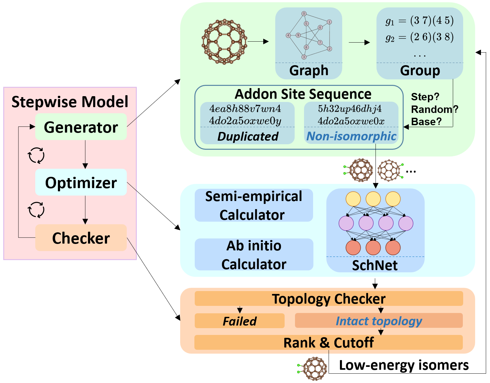
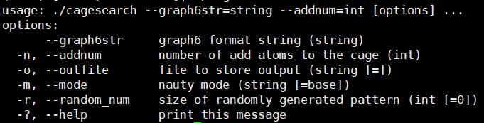

# AutoSteper
 [](https://badge.fury.io/py/autosteper)  [](https://pepy.tech/project/autosteper)   [](https://github.com/Franklalalala/AutoSteper/blob/master/LICENSE.txt)  [](https://autosteper.readthedocs.io/en/latest/?badge=latest) 


Automated Stepwise Addition Procedure for Extrafullerene. 

A detailed description could be found in the article: Exploring exohedral functionalization of fullerene with Automation and Neural Network Potential.

Cite this:
```latex
@article{LIU2023118180,
title = {Exploring exohedral functionalization of fullerene with automation and Neural Network Potential},
journal = {Carbon},
volume = {213},
pages = {118180},
year = {2023},
issn = {0008-6223},
doi = {https://doi.org/10.1016/j.carbon.2023.118180},
url = {https://www.sciencedirect.com/science/article/pii/S0008622323004256},
author = {Mingkang Liu and Yanbo Han and Yonghong Cheng and Xiang Zhao and Hong Zheng},
keywords = {Exohedral fullerene, Neural network potential, Graph theory, Functionalization mechanism, Nanocluster},
}
```



<center>Overview of the Stepwise model.</center>

Demonstration of core functions could be found in `./gym`.

Documentation could be found at https://autosteper.readthedocs.io/.

## Install

## For users

Autosteper has an dependency on multiple python packages, namely, the importlib-metadata, ase, numpy, pandas, networkx, tqdm, matplotlib, seaborn, and dpdispatcher. Installation of all of them along with this project has been integrated into a single command line:

```
pip install autosteper
```

Besides, Autosteper relies on open source project [FullereneDataParser](https://github.com/XJTU-ICP/FullereneDataParser) to convert 3D coordinates to graph6str format and properly visualize isomers, pathways, and SWR pairs. [FullereneDataParser](https://github.com/XJTU-ICP/FullereneDataParser) has not been published on Pypi. According to [Pypi policy](https://setuptools.pypa.io/en/latest/userguide/dependency_management.html#direct-url-dependencies), the unpublished project **could not** be used as a dependency for the published package. Therefore, it needs to be installed separately:

```
pip install git+https://github.com/XJTU-ICP/FullereneDataParser
```

Note: [FullereneDataParser](https://github.com/XJTU-ICP/FullereneDataParser) contains part of C++ code, to properly install, an advanced compiler version is required. Simply load the highest available version of compiler will avoid most of the problems. See below.

Finally, the in-house built C++ project [usenauty](https://github.com/Franklalalala/usenauty) needs to be collected. [usenauty](https://github.com/Franklalalala/usenauty) is a lightweight tool to enumerate non-isomorphic addition patterns with [nauty](https://doi.org/10.1016/j.cpc.2020.107206) algorithm which is created by Brendan D. McKay. The original modification is performed in [usenauty](https://github.com/saltball/usenauty) by XJTU-ICP member Y. B. Han. Here we employ a branch version of it. 

Unlike previously mentioned packages, the installation of [usenauty](https://github.com/Franklalalala/usenauty) is different for Linux and Windows. **There are two pre-compiled** releases for two platforms, users are encouraged to [download](https://github.com/Franklalalala/usenauty/releases) the corresponding releases. 

For example, linux users could download the gcc-8.4.0 version with command line as below:

```
wget https://github.com/Franklalalala/usenauty/releases/download/linux/cagesearch
```

After downloading, users need to assign execution permissions and load a gcc environment:

```
chmod +x path/to/cagesearch
module load compiler/gcc/8.4.0
```

Note that, any gcc version above 8.4.0 is technically suitable.

If everything goes well, a gentle notation is expected after executing this binary file: 

```
path/to/cagesearch
```



<center>The usenauty notation.</center>

The absolute path of this file corresponds to the `gen_core_path` in the generator module, as demonstrated in [test_step.py](https://github.com/Franklalalala/AutoSteper/blob/b1ae14e734b2013628ffca241ab44eba6510f970/tests/test_step/test_step.py#L38).

### Tips for users from Chinese Mainland

A [GitHub Proxy](https://ghproxy.com/) will speed up the installation from github:

```
pip install git+https://ghproxy.com/https://github.com/XJTU-ICP/FullereneDataParser
wget https://ghproxy.com/https://github.com/Franklalalala/usenauty/releases/download/linux/cagesearch
```

## For developers

Any contribution is greatly appreciated. To install from the source code, the AutoSteper package:

```
git clone https://github.com/Franklalalala/AutoSteper
cd AutoSteper
pip install . -e
```

The FullereneDataParser package:

```
git clone https://github.com/XJTU-ICP/FullereneDataParser
cd FullereneDataParser
pip install . -e
```

To compile the usenauty project, please follow instructions in [usenauty](https://github.com/Franklalalala/usenauty).

## Note

Issues are welcomed if you have any questions.

Contributions needs to stay in line with [Conventional Commit messages](https://www.conventionalcommits.org/).

Contact me: 1660810667@qq.com
