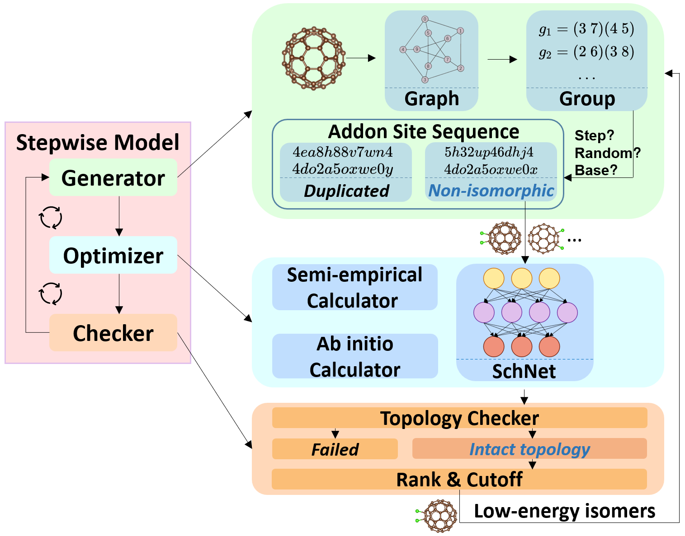
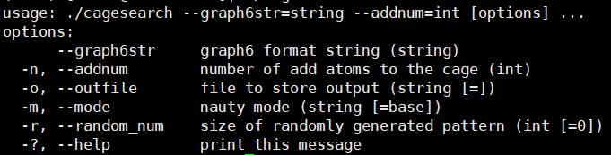

# AutoSteper
Automated Stepwise Addition Procedure for Extrafullerene. 

A detailed description could be found in the article: Exploring exohedral functionalization of fullerene with Automation and Neural Network Potential. 

<center>Overview of the Stepwise model.</center>

Demonstration of core functions could be found in `./tests`.

Documentation could be found in `./doc`.

## Install

## For users

Autosteper has an dependency on multiple python packages, namely, the importlib-metadata, ase, numpy, pandas, networkx, tqdm, matplotlib, seaborn, and dpdispatcher. Installation of all of them and this project has been integrated into a single command line:

```
pip install autosteper
```

Besides, Autosteper relies on open source project [FullereneDataPraser](https://github.com/XJTU-ICP/FullereneDataParser) to convert 3D coordinates to graph6str format and properly visualize isomers, pathways, and SWR pairs. [FullereneDataPraser](https://github.com/XJTU-ICP/FullereneDataParser) has not been published on Pypi, according to [setuptool documentation](https://setuptools.pypa.io/en/latest/userguide/dependency_management.html#direct-url-dependencies), the unpublished project could not be used as a dependency for the published package. Therefore, it needs to be installed separately:

```
pip install git+https://github.com/XJTU-ICP/FullereneDataParser
```

Finally, the in-house built C++ project [usenauty](https://github.com/Franklalalala/usenauty) needs to be collected. [usenauty](https://github.com/Franklalalala/usenauty) is a lightweight tool to enumerate non-isomorphic addition patterns with [nauty](https://doi.org/10.1016/j.cpc.2020.107206) algorithm which is created by Brendan D. McKay. The original modification is performed in [usenauty](https://github.com/saltball/usenauty) by XJTU-ICP member Y. B. Han. Here we employ a branch version of it. 

Unlike previously mentioned packages, the installation of [usenauty](https://github.com/Franklalalala/usenauty) is different for Linux and Windows. **There are two pre-compiled** releases for two platforms, users are encouraged to [download](https://github.com/Franklalalala/usenauty/releases) the corresponding releases. 

After downloading, users need to assign execution permissions:

```
chmod +x path/to/cagesearch
```

A simple test is encouraged:

```
path/to/cagesearch
```

If everything goes well, a gentle notation is expected:



<center>The usenauty notation.</center>

## For developers

Any contribution is greatly appreciated. To install from the source code, the AutoSteper package:

```
git clone https://github.com/Franklalalala/AutoSteper
cd AutoSteper
pip install . -e
```

The FullereneDataParser package:

```
git clone https://github.com/XJTU-ICP/FullereneDataParser
cd FullereneDataParser
pip install . -e
```

To compile the usenauty project, please follow instructions in [usenauty](https://github.com/Franklalalala/usenauty).

## Note

Issues are welcomed if you have any questions.

Contributions needs to stay in line with [Conventional Commit messages](https://www.conventionalcommits.org/).

Contact me: 1660810667@qq.com
