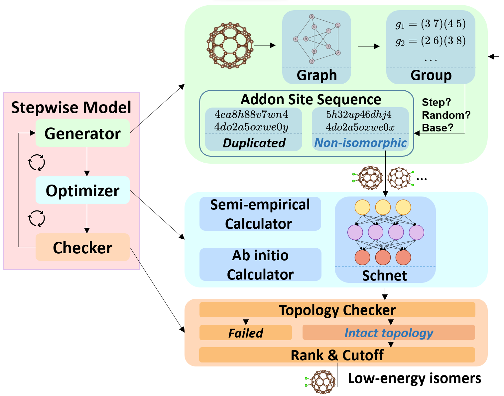

# AutoSteper
Automated Stepwise Addition Procedure for Extrafullerene. 

A detailed description could be found in the article: Exploring exohedral functionalization of fullerene with Automation and Neural Network Potential. 

<center>Overview of the Stepwise model.</center>

Demonstration of core functions could be found in `./tests`.

## Install

### 1. Enumeration

AutoSteper relies on OpenSource projects [FullereneDataPraser](https://github.com/XJTU-ICP/FullereneDataParser) and [usenauty](https://github.com/Franklalalala/usenauty) to properly enumerate non-isomorphic addition patterns.

[FullereneDataPraser](https://github.com/XJTU-ICP/FullereneDataParser) is an excellent python package to handle fullerene-related research problems, this project utilizes it to convert 3D coordinates to graph6str format. For install:

```
git clone https://github.com/XJTU-ICP/FullereneDataParser
cd FullereneDataParser
pip install .
```

[usenauty](https://github.com/Franklalalala/usenauty) is a lightweight tool to enumerate non-isomorphic addition patterns with [nauty](https://doi.org/10.1016/j.cpc.2020.107206) algorithm. The original project is in [usenauty](https://github.com/saltball/usenauty), here we employ a branch version of it. For install:

```
git clone https://github.com/Franklalalala/usenauty
mkdir build
cd build
cmake ../usenauty
```

The absolute path of compiled `cagesearch` file corresponds to the `gen_core_path` button in `generator` module.

### 2. Main project

To install the main project:

```
pip install AutoSteper
```

For other reliance:

```
pip install pytest-shutil, ase, numpy, pandas, networkx, tqdm, matplotlib, seaborn, dpdispatcher
```

To install from source code:

```
git clone https://github.com/Franklalalala/AutoSteper
cd AutoSteper
pip install .
pip install -r requirements.txt
```

## Note

Issues are welcomed if you have any questions.

Contact me: 1660810667@qq.com