<center><font size='70'>AutoSteper</font></center>
<center>Liu Mingkang (刘明康)</center>
<center>2023.03.10</center>
<center>V1.1.2</center>


<div STYLE="page-break-after: always;"></div>

[TOC]


<div STYLE="page-break-after: always;"></div>

## Introduction

AutoSteper is a python package to simulate and analyze the stepwise reaction in chemistry. Currently, it well supports the exohedral fullerene systems $\rm C_{2n}X_m(X=H, F,Cl, Br,OH, CF_3, CH_3)$. Our lab is working intensively to cover more scenarios. Extensions and issues are greatly appreciated.

The stepwise reaction of exohedral fullerenes originated from the radical-addition theory,[^1] in which the functionalization of fullerenes is described to be a radical attack behavior. Functional groups attack the carbon cage one by one, and the energetically favored adducts could be isolated. 

AutoSteper is designed to simulate this procedure in a fully automated fashion (denoted as growth simulation ). It consists of 3 modules, namely, the generator, the optimizer, and the checker. As shown in Fig 1, the generator is designed to enumerate addition patterns and build quasi-equilibrium molecules. The optimizer is in charge of optimizing these molecules with 3rd party software. The checker is to ensure the optimized molecule maintains an intact structure.


<center>Fig 1. Overview of the stepwise model.</center>

Despite the simulation of the stepwise addition procedure, AutoSteper provides automated topological analysis as well. Since the simulation generates valuable low-energy intermediates and the parent-son information is stored in every step, the topological linkage information could be easily extracted. Fig 2 well explains the topological linkage, that is, the relationship between $\rm C_{2n}X_m$ and its parent $\rm C_{2n}X_{m-2}$, son $\rm C_{2n}X_{m+2}$. 

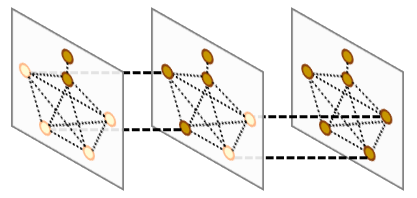

<center>Fig 2. Illustration of the topological linkage.</center>

This information is critical when one trying to parse pathways for a specific product,[^2] however, when it comes to different systems, the topological information needs to be re-generated. As an example, AutoSteper parses the Stone-Wales Rearrangement (SWR) phenomenon[^3] by solving the subgraph isomorphism problem with the assistance of the `networkx` package. Fig 3 illustrates one of the SWR phenomena, in which a cage skeleton transformation takes place when the functional groups attack.


<center>Fig 3. Illustration of an SWR scenario.</center>

Since the subgraph isomorphism function is relatively slow, only limited isomers could be considered. Similarly, this function could also be used to re-generate pathways and draw the binding energy profile.

Installation, details of each module as well as the post-analysis functions are presented below. 

## Install

### Enumeration

AutoSteper relies on OpenSource projects [FullereneDataPraser](https://github.com/XJTU-ICP/FullereneDataParser) and [usenauty](https://github.com/Franklalalala/usenauty) to properly enumerate non-isomorphic addition patterns.

[FullereneDataPraser](https://github.com/XJTU-ICP/FullereneDataParser) is an excellent python package to handle fullerene-related research problems, this project utilizes it to convert 3D coordinates to graph6str format. For install:

```
git clone https://github.com/XJTU-ICP/FullereneDataParser
cd FullereneDataParser
pip install .
```

[usenauty](https://github.com/Franklalalala/usenauty) is a lightweight tool to enumerate non-isomorphic addition patterns with [nauty](https://doi.org/10.1016/j.cpc.2020.107206) algorithm. The original project is in [usenauty](https://github.com/saltball/usenauty), here we employ a branch version of it. For install:

```
git clone https://github.com/Franklalalala/usenauty
cd usenauty
mkdir build
cd build
cmake .. -G "Unix Makefiles"
make
```

Note: The [CXX standard](https://en.wikipedia.org/wiki/C%2B%2B17) is set to be **17**, which means the gcc version need to be 8 or higher, or a higher version of IDE, such as [Visual Studio 2017](https://en.wikipedia.org/wiki/Microsoft_Visual_Studio#2017). The cmake version need to be **3.1** or higher. There are two pre-compiled releases for Windows and Linux platform, respectively.

The absolute path of compiled `cagesearch` file corresponds to the `gen_core_path` button in `generator` module.

### Main project

To install the main project:

```
pip install AutoSteper
```

For other reliance:

```
pip install pytest-shutil, ase, numpy, pandas, networkx, tqdm, matplotlib, seaborn, dpdispatcher
```

To install from source code:

```
git clone https://github.com/Franklalalala/AutoSteper
cd AutoSteper
pip install .
pip install -r requirements.txt
```

## AutoSteper

AutoSteper is the highest level of abstraction. It controls sub-modules to simulate the entire stepwise addition process. It has 3 different modes, corresponding to the 3 generator’s modes. Details are presented below:

- `step`: the stepwise simulation.
- `random`: randomly generate isomers and optimize them to an equilibrium state.
- `base`: enumerate and evaluate all the non-isomorphic isomers for a specific addon number.

Except for these functions, AutoSteper provides engineering-related features, such as `restart` and `error handling`. For details see the `engineering` section.

### step

The input script below is a typical case:

```python
import os

from autosteper import AutoSteper

mach_para = {
    'batch_type': "x",
    'context_type': "SSHContext",
    'remote_root': 'xx/',
    'remote_profile': {
        "hostname": "xx",
        "username": "xx",
        "password": "xx",
        "port": 22,
        "timeout": 10
    }
}

resrc_para = {
    'number_node': 6,
    'cpu_per_node': 6,
    'gpu_per_node': 0,
    'group_size': 10,
    'queue_name': "batch",
    'envs': {
        "OMP_STACKSIZE": "4G",
        "OMP_NUM_THREADS": "3,1",
        "OMP_MAX_ACTIVE_LEVELS": "1",
        "MKL_NUM_THREADS": "3"
    },
    'sub_batch_size': 50
}

para = {
    'pristine_path': r'geom.xyz',
    'root': r'./',
    'gen_para': {'group': 'Cl',
                 'geom_mode': 'pre_defined',
                 'gen_core_path': r'xx\cagesearch.exe'
                 },
    'opt_mode': 'xtb',
    'opt_para': {
        'cmd_list': [r'xx/xtb', '--opt', 'tight', '--json'],
        'out_list': ['xtbopt.xyz', 'xtbopt.log', 'xtbout.json'],
        'deal_wrong_mode': 'Report',
        'mach_para': mach_para,
        'resrc_para': resrc_para,
    },
    'run_para': {
        'start': 1,
        'stop': 4,
        'step': 1,
        'wht_list_para': {
            'mode': 'rank',
            'rank': 5
        }
    },
}

# raw folder is pre-defined
auto = AutoSteper(para=para)
auto.run()
```

The `resrc_para` and `mach_para` are designed to configure a suitable environment for optimizers. (see optimizer module) After that, one needs to configure the parameter of the class `AutoSteper`. Specifically, one needs to provide:

* `pristine_path`: the path to the pristine cage. It could be in any mainstream structure format, only if the [ASE](https://wiki.fysik.dtu.dk/ase/ase/io/io.html#ase.io.read) package supports it.
* `root`: the ABSOLUTE path to the growth simulation workbase, where the AutoSteper would make a directory in the name of the pristine cage. Fig 4 presents one of the workbase directory.

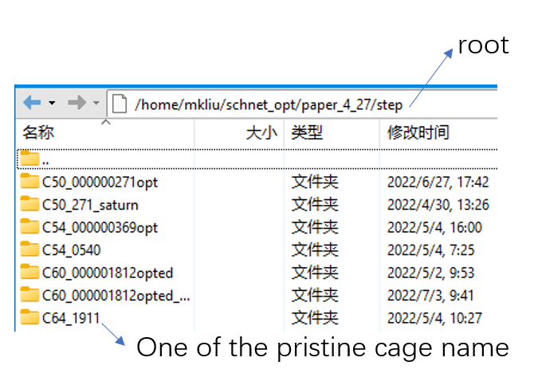

<center>Fig 4. An AutoSteper workbase.</center>

The `gen_para` and `opt` parameters configure a generator and an optimizer. To simulate a stepwise addition reaction, one needs to provide the `run_para` with the following parameters considered.

* `start`: the addition stage ($\rm C_{2n}X_{start}$) when the simulation started. The first step will enumerate and evaluate all the non-isomorphic isomers without any filter.
* `stop`: the addition stage ($\rm C_{2n}X_{stop}$) when the simulation started.
* `step`: number of the newly attached functional groups after the first step.
* `wht_list_para`: parameters to control the isomers saved in every step. These isomers will serve as seeds in the next step to generate derivatives. The white list is a relatively concept to the blacklist. 7 modes could be selected, details see [AutoSteper/test_cutoff.py](https://github.com/Franklalalala/AutoSteper/blob/master/tests/test_cutoff/test_cutoff.py). The default mode is `rank_and_value`, in which the `rank` is 200, and the `value` is 1eV. `rank_and_value` means the lower boundary of two of them.

AutoSteper would create sub-workbases for every addon number. Fig 5 presents one of the scenarios. In this case, the `start` value is 1, the `stop` value is 10, and the `step` value is 1.

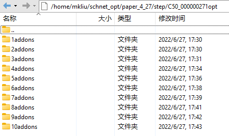

<center>Fig 5. An AutoSteper sub-workbase.</center>

The directory of the **first** step is illustrated in Fig 6.

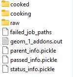

<center>Fig 6. The first step workbase.</center>

The functions of each file/directory are presented below.

* `raw`: the quasi-equilibrium isomers built in every step.
* `cooked`: the equilibrium state of each isomer, in `xyz` format.
* `cooking`: the real workbases for each optimization job. It typically contains more optimization details than the `cooked` folder.
* `failed_job_paths`: the absolute path of each failed optimization job as well as their corresponding failed status code.
* `geom_1_addons.out`: the enumerated addition patterns in the first step. `geom` is the name of the pristine cage, `1` is the addon number of the first step.
* `passed_info.pickle`: key information of the optimization jobs that **passed** the topological check. In the early version of AutoSteper, this file is called `deep_yes_info.pickle`, meaning information is stored in a deep chart. Fig 7 presents one of the scenarios. The meaning of each column is presented below:
  * `name`: the name for each isomer, in 36 format.
  * `energy`: the equilibrium energy of each isomer, in units eV.
  * `xyz_path`: the absolute path to each isomer structure, in `xyz` format.
  * `nimages`: the number of images in each optimization trajectory.


<center>Fig 7. Example of the passed_info.</center>

* `parent_info.pickle`: key information of the **parent-son** relationships generated during the growth simulation. In the early version of AutoSteper, this file is called `flat_yes_info.pickle`, meaning information is stored in a flat chart, and only the passed isomers are considered. The flat format enables a fast index when parsing the topological information.
  * The first step is different from others since there is only one parent for all the $\rm C_{2n}X_{start}$ isomers. Fig 8 presents one of the cases. The columns correspond to each $\rm C_{2n}X_{start}$ isomer. The first row corresponds to their energy.
  * Fig 9 presents a case in the proceeding addition stages. The columns correspond to each $\rm C_{2n}X_{m}, m>start$ isomer. The first row stores the names of their parent(s). Note that, isomers in $\rm C_{2n}X_{m}$ addition stage could have more than one parent $\rm C_{2n}X_{m-step}$. The second row corresponds to their energy. 

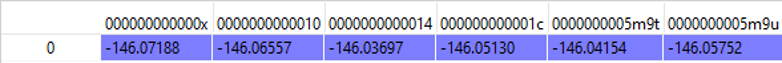

<center>Fig 8. Example of the parent_info in the first step.</center>

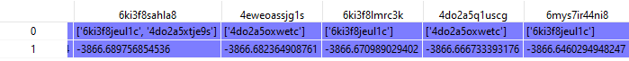

<center>Fig 9. Example of the parent_info in the proceeding addition stages.</center>

* `status_info.pickle`: the status code for each optimization job, in flat chart format for indexing convenience. Note that this status code is different from the failed status code. Only three codes are available:
  * `0`: normal termination.
  * `-1`: topological intactness is undermined. (failed topology check)
  * `-2`: wrong jobs. This would happen when there are no files retrieved from computational resources, for example, the internet is broken.

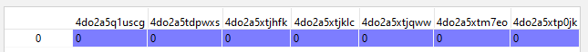

<center>Fig 10. Example of the status_info.</center>

The directory of the **proceeding addition stages** is illustrated in Fig 11. The difference compared with the first step is presented below:

- `sub_nauty`: there is more than one parent that generates derivatives. Related information is dumped in this folder.


<center>Fig 11. The workbase for the proceeding addition stages.</center>

- `all_parent_info.pickle`: the parent-son information for all the $\rm C_{2n}X_{m}$ isomers. (see Fig 12.) This is generated when building the quasi-equilibrium isomers. Note that the `parent_info.pickle` only considers the passed ones, and it contains energy info. The `all_parent_info.pickle` stores duplicated but more detailed information, therefore it may be useful for future development.


<center>Fig 12. Example of the all_parent_info.</center>

### random

The random mode could be used to sample targeted configuration space, for example, building a dataset to train Neural Network Potential (NNP). The parameters for random mode are basically the same as the step mode. Differences lie in the `run_para`, which is replaced by `random_para`. Specifically, one needs to provide:

- `addon_list`: a list that consists of desired addon numbers, e.g, $\rm C_{2n}X_{m}, m\ in\ addon\_list$.
- `random_num`: for each addon number m, the number of randomly sampled isomers $\rm C_{2n}X_{m}$.
- `try_times`: since some systems are highly unstable, e.g, $\rm C_{2n}X_{m}, m=2n$, all the isomers sampled could be unphysical and fail the topological check. In this case, the whole batch of isomers $\rm C_{2n}X_{m}$ should be discarded. This parameter is highly recommended to control the failed chances. Note that, it needs `deal_wrong_mode` set as `Tough` to properly function.

Despite these parameters, the execution method of AutoSteper changed from `run` to `random`. For an example script, see [AutoSteper/test_random.py](https://github.com/Franklalalala/AutoSteper/blob/master/tests/test_random/test_random.py).

### base

The base mode could be used to enumerate and evaluate all isomers for a specific system $\rm C_{2n}X_{m}$. In fact, it could be viewed as the first step in the step mode. Since the base mode has only one step, its input script doesn’t need `run_para`. The rest of the parameters stay the same as above. The execution method of AutoSteper changed from `run` to `base`. For an example script, see [AutoSteper/test_base.py](https://github.com/Franklalalala/AutoSteper/blob/master/tests/test_base/test_base.py).

## Engineering

Currently, AutoSteper provides `restart` and `error_handling` for engineering convenience. More features are under development.

### restart&proceed

The `restart` feature is designed for the step mode in case the simulation is interrupted. To use it, simply replace the execution method of AutoSteper to `restart`. For example:

```python
# auto.run()
auto.restart(restart_add_num=5)
```

Note that, the `restart` method will delete the original workbase for $\rm C_{2n}X_{m}, m>= restart\_add\_num$, after that, a new workbase will be created for $\rm C_{2n}X_{m}, m= restart\_add\_num$. Make sure the `restart_add_num` equals the exact addon stage when the simulation was interrupted.

Besides, this feature could be used to **proceed** with a normally terminated simulation. For example, the original one terminated in `add_num = 4`, and the restart_add_num could be set as `4+step`.

### error handling

The `error_handling` feature is assigned to optimizers. For description convenience, details of them are presented in this section. Note that, the `error` mentioned here denotes an unexpected optimization task result, which is different from the `failed` notation.

There are 3 modes in total. Specifically:

- `Report`: simply report the wrong information and end out.
- `Complete`: recursively submit jobs in small batches to minimize the wrong jobs, then end out. Note that, the dpdispatcher submits jobs in a batch style. When there is one job ends unexpectedly, there would be no retrieval from the remote for the whole batch. The `Complete` mode will submit recursively with small batches until the abnormal ones are left.
- `Tough`: designed for `random` mode in case the whole batch of randomly generated isomers are unphysical.

## Optimizer

The optimizer module heavily rely on open-source package [deepmodeling/dpdispatcher](https://github.com/deepmodeling/dpdispatcher). See [Getting Started](https://docs.deepmodeling.com/projects/dpdispatcher/en/latest/getting-started.html) to get familiar with dpdispatcher. Here presents the usage of AutoSteper’s customized version.

### machine and resource

To start with, one needs to set a machine and a resource configuration. Here present some examples.

For the machine parameter, two sets of configurations are recommended. See below:

```python
# from local (typically your win system) to clusters. Input scripts are submitted in Personal Computer (PC).
mach_para = {
    'batch_type': "Torque",  # my cluster type
    'context_type': "SSHContext",
    'remote_root': '/home/test/xx/',  # the remote workbase where the actual computation take place.
    'remote_profile': {
        "hostname": "2xx.2xx.xx.7x",  # IP
        "username": "xx",
        "password": "xx",
        "port": 22,
        "timeout": 10
    }
}

# inside your clusters. Input scripts are submitted in the cluster.
mach_para = {
    'batch_type': "Torque",  # my cluster type
    'context_type': "LocalContext",  # Do not need IP information
    'remote_root': '/home/test/xx/',
    'remote_profile': None
}
```

For the resource parameter, here is an example:

```python
resrc_para = {
    'number_node': 6, # the sequence name for your cluster.
    'cpu_per_node': 6, # computational resources for each task.
    'gpu_per_node': 0, # same as above
    'group_size': 10, # number of tasks contained in each job (group).
    'queue_name': "batch", # queue name for my cluster
    'envs': {              # extra enviromental variables
        "OMP_STACKSIZE": "4G",
        "OMP_NUM_THREADS": "3,1",
        "OMP_MAX_ACTIVE_LEVELS": "1",
        "MKL_NUM_THREADS": "3"
    },
    'sub_batch_size': 50 # number of tasks contained in each batch.
}
```

The machine parameters tell the dpdispatcher **which cluster** to use and **how to contact**, while the resource parameter **assigns** computation resources to each job.

The original workflow of the dpdispatcher is illustrated in Fig 13.

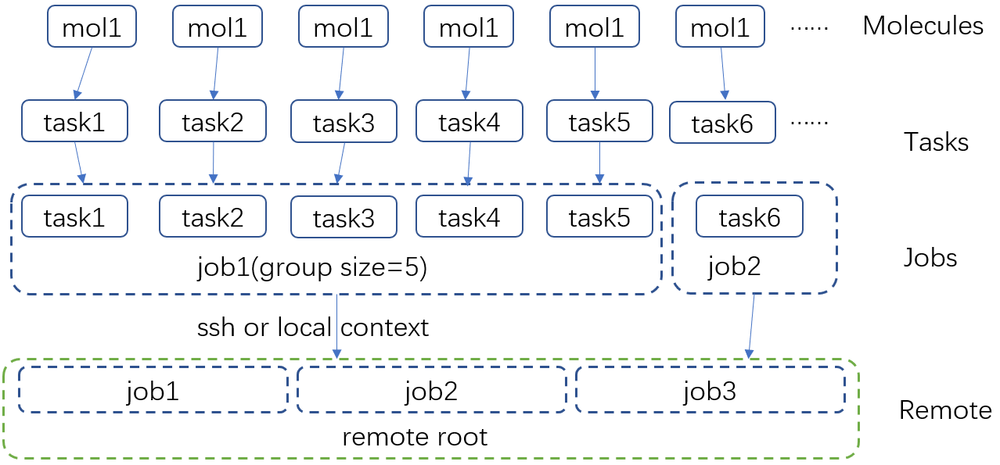

<center>Fig 13. Simplified workflow of dpdispatcher.</center>

Each optimization job corresponds to a task. Then, tasks are grouped (`group_size`) into jobs. These jobs are submitted through ssh or local context (`context_type`) to remote (`remote_root`), where the remote would assign computational resources to each job (`All_cpu_cores /cpu_per_node`) and execute them in parallel.

However, when it comes to huge task sequences, the number of groups in line may put pressure on the cluster. And when something wrong happened in a single job, the whole batch would be undermined. (For example, no retrieval from remote.) Therefore, we proposed the `sub_batch_size` parameter to perform job dispatch in a mini-batch style. An illustration of the modified dpdispatcher is presented in Fig 14. 

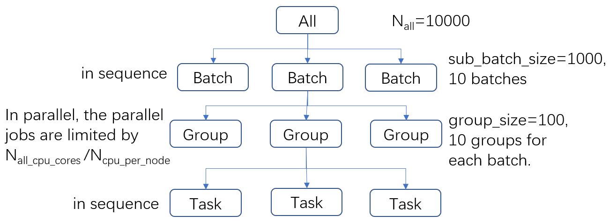

<center>Fig 14. A top-down illustration of the modified dpdispatcher.</center>

More details could be found in the documentation of [Machine parameters](https://docs.deepmodeling.com/projects/dpdispatcher/en/latest/machine.html) and [Resources parameters](https://docs.deepmodeling.com/projects/dpdispatcher/en/latest/resources.html). 

### opt mode and parameter

Currently, AutoSteper provides interfaces for 3 software, namely, the [xTB](https://xtb-docs.readthedocs.io/en/latest/contents.html) program, the [Gaussian](https://gaussian.com/) software, and the [ASE](https://wiki.fysik.dtu.dk/ase/about.html) python library. Examples could be found in [test_ASE_Optimizer](https://github.com/Franklalalala/AutoSteper/tree/master/tests/test_ASE_Optimizer), [test_Gaussian_Optimizer](https://github.com/Franklalalala/AutoSteper/tree/master/tests/test_Gaussian_Optimizer), and [test_XTB_Optimizer](https://github.com/Franklalalala/AutoSteper/tree/master/tests/test_XTB_Optimizer).

In addition, AutoSteper provides the `Multi_Optimizer` to properly integrate different software or employ the same software repeatly. Examples could be found in [test_multi_optimizer](https://github.com/Franklalalala/AutoSteper/tree/master/tests/test_multi_optimizer).

The details about related parameters are presented below:

1. `opt_mode`: tells the `AutoSteper` class or the `switch_optimizers` function which optimizer to choose. 
2. `cmd_list`: the actual command line in the final workbase (without the filename). It consists of the call of the program, options, flags, and so on.
3. `out_list`: the names of output files that need to be downloaded.
4. `deal_wrong_mode`: how to deal with wrong jobs, details see the engineering section.
5. `has_parity`: The spin multiplicity is different between odd and even addon number isomers. Set this button true if you intend to simulate odd addon number isomers. This will enabling an automated multipicity check.

## Generator

The generator module is in charge of building molecules. Details of parameters are presented below:

- `group`: the name of functional groups. Currently, AutoSteper supports $\rm C_{2n}X_m(X=H, F,Cl, Br,OH, CF_3, CH_3)$.

- `gen_core_path`: the absolute path to the executable binary file `cagesearch`, which is compiled from the [Franklalalala/usenauty](https://github.com/Franklalalala/usenauty) repository. 
-  `geom_mode`: decides how to build quasi-equilibrium isomers. This parameter is highly recommended to be set as `pre_defined`. The pre-defined geometry parameters are chosen from thousands of randomly sampled isomers. If one needs to change these parameters, set `geom_mode` to another value and assign new parameters through `geom_para`. Note that, the new format needs to stay consistent with [the original](https://github.com/Franklalalala/AutoSteper/blob/18f474b0dd58adc9cd7484007a14927e2cde5123/src/autosteper/generator.py#L12).

Note that, the generator module could be used alone to build hand-tuned structures. See [AutoSteper/test_build_unit.py](https://github.com/Franklalalala/AutoSteper/blob/master/tests/test_build_unit/test_build_unit.py).


## Checker

The checker module will check optimized isomers to ensure an undermined topology. 7 scenarios could be detected, their corresponding failed status codes are presented below.

1. At least one functional group breaks the bond with the cage and becomes a radical.
2. At least one functional group deviates from the initial addition site and moves to another.
3. At least one 3-membered carbon ring is formed during optimization, meaning the pristine cage is squeezed by functional groups.
4. At least one carbon atom only has 2 neighboring carbon atoms or less, meaning the cage is broken.
5. At least one functional group binds with 2 or more carbon atoms, which is unstable for currently supported functional groups.
6. At least one carbon atom binds with 5 or more atoms, which means a small cluster or a coordination is formed.
7. The inner intactness of at least one functional group ($\rm OH, CF_3, CH_3$) is undermined.

These status codes will be reported in the `failed_job_paths` file.

Need to mention that, the AutoSteper module doesn’t need any specific input parameters for the checker module, though it could also be used alone. See [AutoSteper/test_checker.py](https://github.com/Franklalalala/AutoSteper/blob/master/tests/test_checker/test_checker.py).

## Blacklist

The concept of the blacklist is based on the assumption that high-energy isomers probably contain local instability motifs, therefore their derivatives will unlikely to become stable ones since they still contain those instability motifs. This is a dual concept to the low-energy configuration space, which is treated as seeds to generate derivatives. See Fig 15.

AutoSteper collects two kinds of isomers into the blacklist.

1. The isomers that failed the topological check. (denote as failed)
2. The high-energy isomers within certain reverse cutoff. (denote as unstable)

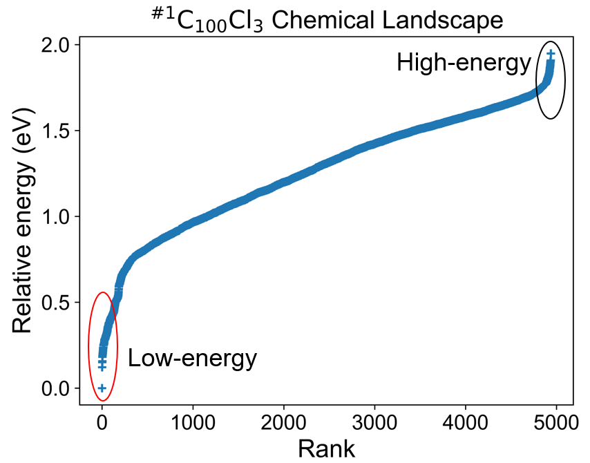

<center>Fig 15. Illustration of the high-energy configuration space.</center>

When it comes to a new step, the new addition patterns will check through the blacklist at first. If a pattern contains any of the recorded patterns, it will be directly skipped.

To control the influence of a high-energy pattern, AutoSteper provides a queue to store high-energy patterns. See Fig 16.

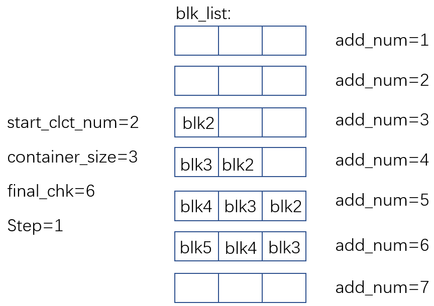

<center>Fig 16. Illustration of the queue maintained by AutoSteper.</center>

AutoSteper starts collecting high-energy isomers in `start_clct_num`. These patterns start functioning in the next step and will continue to function till `start_clct_num+container_size*step`. The blacklist system will shut down after `final_chk`.

To enable the blacklist feature, one needs to provide a `blk_para`. Here is an example of `blk_para`, for example of an input script, see [AutoSteper/test_blk_list.py](https://github.com/Franklalalala/AutoSteper/blob/master/tests/test_black_list/test_blk_list.py)

```python
blk_para = {
    'start_clct_num': 2,
    'final_chk_num': 8,
    'clct_unstb': True,
    'unstb_para': {
        'mode': 'rank',
        'rank': 10,
    },
    'container_size': 3
}
```

Note that, all failed addition patterns are collected by default as long as the blacklist system functions. Another kind of high-energy isomers is collected when the `clct_unstb` is Ture. The `unstb_para` controls the reversed cutoff range, details see [AutoSteper/test_cutoff.py](https://github.com/Franklalalala/AutoSteper/blob/master/tests/test_cutoff/test_cutoff.py). 

## Pre-scan

The pre-scan feature takes the quasi-equilibrium geometry to approximate the equilibrium state isomer. Since AutoSteper builds quasi-equilibrium isomers in a python environment, currently only the python package [ASE](https://wiki.fysik.dtu.dk/ase/about.html) is supported as the single-point evaluator. 

The generated isomer (in `atom` class) would go through a single-point evaluation before dumping to a xyz format file. After the generation of all isomers, the low-energy ones will be selected and re-dumped into the `post_pre_scan_raw` folder. These isomers would undergo geometry optimization with optimizers. Fig 17 presents a working folder when the pre-scan feature is enabled. It’s basically the same as the `step` mode workbase.


<center>Fig 17. The workbase when the pre-scan feature enabled.</center>

To enable a pre-scan feature, one needs to provide a `pre_scan_para`. Here is an example of `pre_scan_para`, for example of an input script, see [AutoSteper/test_pre_scan.py](https://github.com/Franklalalala/AutoSteper/blob/master/tests/test_pre_scan_restart/test_pre_scan.py).

```python
pre_scan_para = {
    'start_ps_para': 2,  # when the pre-scan feature enabled
    'final_ps_para': 3,  # when the last addition stage that the pre-scan feature functions
    'calculator': calculator, # the calculator in ASE format
    'ps_cut_para': {     # to control the cutoff range
        'mode': 'rank',
        'rank': 80
    }
}
```

Note:

1. The `calculator` needs to stay in [ASE](https://wiki.fysik.dtu.dk/ase/ase/calculators/calculators.html#calculators) format. 
2. The `ps_cut_para` controls the cutoff range for the isomers that need geometry optimization.

## Post-analysis

AutoSteper provides multiple functions and abstractions to perform the post-analysis. Here presents a brief introduction.

### refine

When one needs to improve computational accuracy, the `refine` function in the `parser` module presents a nice solution. Only 3 parameters are needed to perform a refinement procedure. That is:

- `old_workbase`: the original workbase.
- `new_workbase`: the new workbase.
- `ref_para`: the same format as the optimizer’s parameter to configure an optimizer.

That’s it. AutoSteper will refine the original data and dump them into the new workbase. For details, see [AutoSteper/test_refine.py](https://github.com/Franklalalala/AutoSteper/blob/master/tests/test_ref/test_refine.py).

### isomorphism test

AutoSteper provides 3 functions to perform the isomorphism test. For example, see [AutoSteper/test_iso_relatives.py](https://github.com/Franklalalala/AutoSteper/blob/master/tests/test_iso_relatives/test_iso_relatives.py).

Details are presented below:

#### simple_test_iso

This function is designed to test whether a specific isomer $\rm ^{\#M}C_{2n}X_{m}$ is within the simulation results $\rm ^{\#M}C_{2n}X_{m}\_q,0<q<=max\_rank$. If it’s indeed within the results, this function will output its corresponding rank $\rm q$. One needs to provide:

- `q_atoms`: the queried isomer, in [ASE Atoms format](https://wiki.fysik.dtu.dk/ase/ase/atoms.html#module-ase.atoms).
- `passed_info_path`: the absolute path to the queried `passed_info.pickle`.
- `top_k`: a cutoff performed on the `passed_info.pickle`, `rank` mode only.  If none, AutoSteper will scan all the simulation results.

#### simple_log_relatives

This function is designed to quickly find relatives of a specific isomer $\rm ^{\#M}C_{2n}X_{m}$ and log key information to a writeable path. Here relatives mean the intermediates ($\rm ^{\#M}C_{2n}X_{q}, q<m$), isomer ($\rm ^{\#M}C_{2n}X_{q}, q=m$) and derivatives ($\rm ^{\#M}C_{2n}X_{q}, q>m$) of the queried isomer. To ensure a fast test, here use the addition patterns as a criterion. 

Two ways to decide the queried addition pattern.

- The recommended way to get the addition pattern:

  - `q_atoms`: the queried isomer, in [ASE Atoms format](https://wiki.fysik.dtu.dk/ase/ase/atoms.html#module-ase.atoms). Note that, it needs to have an identical pristine cage to the target. This ensures an identical sequence.

  - `group`: the symbol of the functional group.

  - `cage_size`: the size of the pristine cage.

- The second way to get the addition pattern:

  - `q_seq`: the 36-base format name. See [the 36 base function](https://github.com/Franklalalala/AutoSteper/blob/18f474b0dd58adc9cd7484007a14927e2cde5123/src/autosteper/cage.py#L59).

  - `q_cage`: the key to decipher the 36-base name to a sequence, in [AutoSteper/cage](https://github.com/Franklalalala/AutoSteper/blob/18f474b0dd58adc9cd7484007a14927e2cde5123/src/autosteper/cage.py#L11) format.

After that, one needs to provide:

- `fst_add_num`: the smallest addon number to be scanned.
- `final_add_num`: the biggest addon number to be scanned.
- `step`: the step that used in the growth simulation.
- `workbase`: the original workbase.
- `dump_log_path`: the absolute path to dump the related information.

[Here](https://github.com/Franklalalala/AutoSteper/blob/master/tests/test_iso_relatives/rel.log) is an example of the dumped log.

#### strict_scatter_relatives

This function is designed to strictly find relatives of a specific isomer. It implements the [subgraph_is_isomorphic](https://networkx.org/documentation/latest/reference/algorithms/generated/networkx.algorithms.isomorphism.GraphMatcher.subgraph_is_isomorphic.html#graphmatcher-subgraph-is-isomorphic) function to perform the isomorphism test and dump information in a png format (see Fig 18). The input parameters are basically the same as the above function. The difference is that it needs a folder to dump information. 

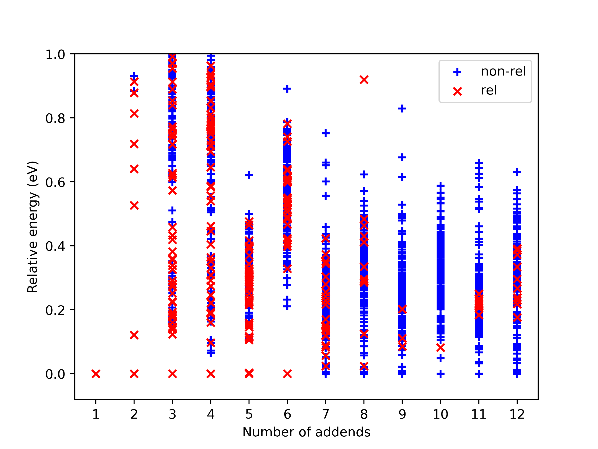

<center>Fig 18. Example of the dumped information. The red 'x' presents a relative, blue '+' is a non-isomerphic one.</center>

In addition, AutoSteper dumps the relative energy of each scanned isomer, and groups them into the `non_rel_e` and `rel_e`.

### cook_disordered

To better analyze the low-energy configuration space, AutoSteper provides the `cook_disordered` function to translate disordered log files into structured information. Two folders and one pickle file will be generated. Details are presented below:

* `pathway_info.pickle`: information for all the pathways. `name` column meaning the pathway-related names, `rel_e` corresponds to the relative energy of isomers, `e_area` means the relative energy of pathways.
* `./sorted`: sorted information for isomer rankings. And this is a standard output <a id="format">format</a>.
  * `./sorted/log`: the final optimization logs for a specific isomer. File names contain two metrics. The first number means the number of addends, the last number means the ranking of the specific isomer. For example, `1_addons_1` means it contains 1 addend and its energy rank is 1 (the lowest energy one).
  * `./sorted/xyz`: the final image of the optimization trajectory. The name convention is the same as above.
  * `./sorted/info`: energy information.
  * `./sorted/connection`: connection information. `1_addons_1.npy` corresponds to the isomer, whose geometry information is stored in `1_addons_1.xyz`. This isomer has connection relationships with higher addends, here in this case, it means 2 addends. `1_addons_1.npy` stores this information, 1 meaning connected, 0 for not.
* `./pathways`: pathway-related isomers. `traj.log` for the whole trajectory.

One needs to provide following parameters:

- `disordered_root`: path to the disordered root.
- `dump_root`: path to dump information.
- `keep_top_k_pathway`: how many generated pathways to keep. (in rank mode)
- `step`: the step of the original growth simulation.
- `log_mode`: two log formats are supported. 1. the gaussian format, type key word `gauss`. 2. the xyz format, type key word `xyz`.

For an example, see [AutoSteper/test_cook_disordered.py](https://github.com/Franklalalala/AutoSteper/blob/master/tests/test_cook_disordered/test_cook_disordered.py). 

On the bases of structured information, one can easily perform topological analysis. See `find_SWR` and `get_binding_e` in below.

### find_SWR

For description convenience, here we denote an isomer before and after an SWR as $\rm ^{\#1}C_{2n}Cl_{2m}$ and $\rm ^{\#2}C_{2n}Cl_{2(m+1)}$. The $\rm ^{\#1}C_{2n}$ system is represented as the query system and $\rm ^{\#2}C_{2n}$ is the target system. 

One needs to provide the following parameters:

- `q_sorted_root`: the sorted information provided by the `cook_disordered` function. This root corresponds to the query system.
- `tgt_sorted_root`: same as above, for the target system. 
- `swr_dump_path`: where to dump the information.
- `step`: the step of the original growth simulation.
- `is_unique`: if true, for every atoms in q_root, only one SWR target is outputted, typically for the lowest energy isomer, here we take the rank info in the name as criteria.
- `is_low_e`: if true, for every atoms in q_root, only one SWR target is outputted, and it should have lower energy than the 'ought to be' parents.

Details about the output are presented below:

`./swr_dump_path`: Automated generated SWR pairs. 

* For example, `q_14_to_tgt_15` means SWRs between $\rm ^{\#14}C_{2n}Cl_{2m}$ and $\rm ^{\#15}C_{2n}Cl_{2(m+1)}$
* `q_14_to_tgt_15/0_to_2_swr_1` means SWRs between $\rm ^{\#14}C_{2n}Cl_{0}$ and $\rm ^{\#15}C_{2n}Cl_{2}$. $\rm ^{\#14}C_{2n}Cl_{0}$ means the pristine cage.
* The `1` in `0_to_2_swr_1` means this query atoms has an energy rank of `1` among other query atoms.  
* In the folder of  `q_14_to_tgt_15/0_to_2_swr_1`, `q_atoms.xyz` is the geometry structure for the query atoms $\rm ^{\#14}C_{2n}Cl_{0}$, `tgt_atoms_rank_1.xyz` is the corresponding target atoms $\rm ^{\#15}C_{2n}Cl_{2}$, since there may be more than one target atoms (if the `is_unique` option is `False`), the `1` in `tgt_atoms_rank_1.xyz` means the energy rank of target atom.

For an example, see [AutoSteper/test_find_SWR](https://github.com/Franklalalala/AutoSteper/tree/master/tests/test_find_SWR). 

### get_binding_e

The binding energy well explains the reaction activity. Based on the structured topological information provided by the `cook_disordered` function, one can easily parse the binding energy information. Set hydrofullerene as an example, AutoSteper following this equation to calculate binding energy.
$$
E_{binding}=E_{C_{66}H_{2m}}-E_{C_{66}H_{2(m-1)}}-E_{H_2}
$$
One needs provide the following parameters:

- `sorted_root`: the structured source folder.
- `cage_e`: the energy of the pristine cage.
- `addends_e`: the energy of the simple substance of addons. Here in this case, its Hydrogen.

Note that, the `cage_e` and `addends_e` need to be calculated under the same computational level as the general isomers.

The output of this function is dumped into the `sorted_root/info/`, in the format of `pickle` and `xlsx`.

For an example, see [AutoSteper/test_binding_e.py](https://github.com/Franklalalala/AutoSteper/blob/master/tests/test_binding_e/test_binding_e.py). 

### Path_Parser

The `Path_Parser` is an abstraction designed to get pathways from the `parent-son` information, which is generated along with the **Growth Simulation**. This feature is considered since the very beginning of AutoSteper. The `parent-son` information could be viewed as a by-product of the simulation, therefore the calculation of pathways is extremely fast.

One needs to provide the following parameters for a basic configuration:

```python
path_para = {
    'step': 1, # the step that used in the growth simulation.
    'start': 1, # when the growth simulation started
    'q_add_num': 4, 
    'q_path_rank': 10,
    'q_isomer_rank': 5,
    'log_low_e_num': 10, 
}
```

The configuration will generate pathways for $\rm C_{2n}X_{m}\_i$. Here the `q_add_num` is the m, the `q_isomer_rank` is i. `log_low_e_num` will dump low-energy isomers $\rm C_{2n}X_{m}\_i, i<log\_low\_e\_num$ into a log. `q_path_rank` will decide how many low-energy pathways to be dumped.

This configuration parses pathways for the specific `q_isomer_rank`. All the pathways end to the $\rm C_{2n}X_{m}\_i, i=q\_isomer\_rank$.

To see a mixed scenario, simply set the `is_mixed` flag to True. See [AutoSteper/test_path_parser_2.py](https://github.com/Franklalalala/AutoSteper/blob/master/tests/test_path_parser/test_path_parser_2.py). The generated pathways will end to $\rm C_{2n}X_{m}\_i, i<=q\_isomer\_rank$.

If one needs a higher accuracy of pathways, there is a refiner option in `Path_Parser`. See [AutoSteper/test_path_parser_2_ref.py](https://github.com/Franklalalala/AutoSteper/blob/master/tests/test_path_parser/test_path_parser_2_ref.py).

If one needs to control the number of pathways, set a `ctl_path_para` as below:

```python
path_para = {
    'step': 1, # the step that used in the growth simulation.
    'start': 1, # when the growth simulation started
    'q_add_num': 22, 
    'q_path_rank': 10,
    'q_isomer_rank': 5,
    'log_low_e_num': 10, 
    'ctl_path_para': {
        'ctl_parent_num': 3, # Control the number of parents for each isomer.
        'max_path_num': 10000, # Control the maximum number of pathways.
    }
}
```

This is for the case when the queried addon number is very high. Since the `Path_Parser` functions in a DFS way, the low-energy pathways will be well preserved.

The generated pathways are highly structured and informative, see [AutoSteper/test_path_parser](https://github.com/Franklalalala/AutoSteper/tree/master/tests/test_path_parser). Here presents the well-designed heatmap. See Fig 19.

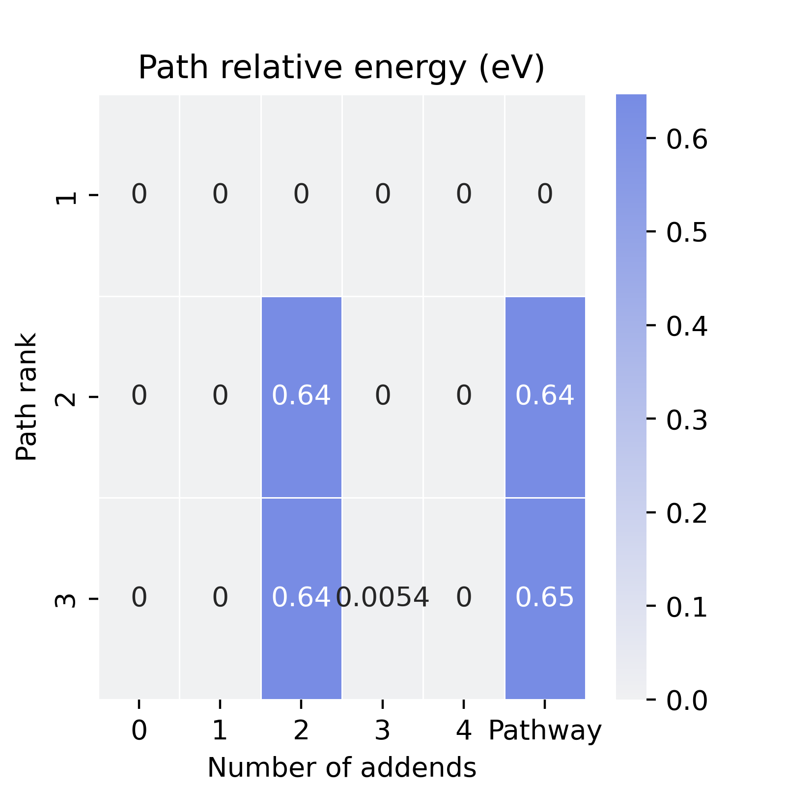

<center>Fig 19. Example of the generated heatmap for pathways.</center>

It well-explained the ranking of pathways. For example, all the related isomers for the pathway in row 1 is the lowest-energy one (relative energy is 0), therefore it’s the lowest-energy pathway.

## Reference

In DOI format.

[^1]: 10.1039/A905719F
[^2]: 10.1038/nchem.549
[^3]: 10.1021/acs.accounts.9b00175
