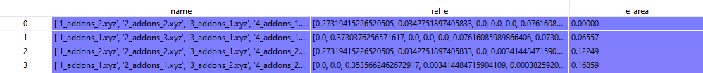

Analysis Functions
==================

AutoSteper provides multiple functions to perform post-analysis. Here
presents a brief introduction.

Refine
------

When one needs to improve computational accuracy, the ``refine``
function in the ``parser`` module presents a nice solution. Only 3
parameters are needed to perform a refinement procedure. That is:

-  ``old_workbase``: the original workbase.
-  ``new_workbase``: the new workbase.
-  ``ref_para``: the same format as the optimizer’s parameter to
   configure an optimizer.

That’s it. AutoSteper will refine the original data and dump them into
the new workbase. For details, see
`AutoSteper/test_refine.py <https://github.com/Franklalalala/AutoSteper/blob/master/tests/test_ref/test_refine.py>`__.

Isomorphism test
----------------

AutoSteper provides 3 functions to perform the isomorphism test. For
example, see
`AutoSteper/test_iso_relatives.py <https://github.com/Franklalalala/AutoSteper/blob/master/tests/test_iso_relatives/test_iso_relatives.py>`__.

Details are presented below:

simple_test_iso
~~~~~~~~~~~~~~~

This function is designed to test whether a specific isomer
:math:`\rm ^{\#M}C_{2n}X_{m}` is within the simulation results
:math:`\rm ^{\#M}C_{2n}X_{m}\_q,0<q<=max\_rank`. If it’s indeed within
the results, this function will output its corresponding rank
:math:`\rm q`. One needs to provide:

-  ``q_atoms``: the queried isomer, in `ASE Atoms
   format <https://wiki.fysik.dtu.dk/ase/ase/atoms.html#module-ase.atoms>`__.
-  ``passed_info_path``: the absolute path to the queried
   ``passed_info.pickle``.
-  ``top_k``: a cutoff performed on the ``passed_info.pickle``, ``rank``
   mode only. If none, AutoSteper will scan all the simulation results.

simple_log_relatives
~~~~~~~~~~~~~~~~~~~~

This function is designed to quickly find relatives of a specific isomer
:math:`\rm ^{\#M}C_{2n}X_{m}` and log key information to a writeable
path. Here relatives mean the intermediates
(:math:`\rm ^{\#M}C_{2n}X_{q}, q<m`), isomer
(:math:`\rm ^{\#M}C_{2n}X_{q}, q=m`) and derivatives
(:math:`\rm ^{\#M}C_{2n}X_{q}, q>m`) of the queried isomer. To ensure a
fast test, here use the addition patterns as a criterion.

Two ways to decide the queried addition pattern.

-  The recommended way to get the addition pattern:

   -  ``q_atoms``: the queried isomer, in `ASE Atoms
      format <https://wiki.fysik.dtu.dk/ase/ase/atoms.html#module-ase.atoms>`__.
      Note that, it needs to have an identical pristine cage to the
      target. This ensures an identical sequence.

   -  ``group``: the symbol of the functional group.

   -  ``cage_size``: the size of the pristine cage.

-  The second way to get the addition pattern:

   -  ``q_seq``: the 36-base format name. See `the 36 base
      function <https://github.com/Franklalalala/AutoSteper/blob/18f474b0dd58adc9cd7484007a14927e2cde5123/src/autosteper/cage.py#L59>`__.

   -  ``q_cage``: the key to decipher the 36-base name to a sequence, in
      `AutoSteper/cage <https://github.com/Franklalalala/AutoSteper/blob/18f474b0dd58adc9cd7484007a14927e2cde5123/src/autosteper/cage.py#L11>`__
      format.

After that, one needs to provide:

-  ``fst_add_num``: the smallest addon number to be scanned.
-  ``final_add_num``: the biggest addon number to be scanned.
-  ``step``: the step that used in the growth simulation.
-  ``workbase``: the original workbase.
-  ``dump_log_path``: the absolute path to dump the related information.

`Here <https://github.com/Franklalalala/AutoSteper/blob/master/tests/test_iso_relatives/rel.log>`__
is an example of the dumped log.

strict_scatter_relatives
~~~~~~~~~~~~~~~~~~~~~~~~

This function is designed to strictly find relatives of a specific
isomer. It implements the
`subgraph_is_isomorphic <https://networkx.org/documentation/latest/reference/algorithms/generated/networkx.algorithms.isomorphism.GraphMatcher.subgraph_is_isomorphic.html#graphmatcher-subgraph-is-isomorphic>`__
function to perform the isomorphism test and dump information in a png
format (see Fig 19). The input parameters are basically the same as the
above function. The difference is that it needs a folder to dump
information.

.. image:: ./fig/iso_rel_e.png
   :alt: iso_rel_e
   :align: center

.. raw:: html

   

Fig 1. Example of the dumped information. The red ‘x’ presents a
relative, blue ‘+’ is a non-isomerphic one.

.. raw:: html

   

In addition, AutoSteper dumps the relative energy of each scanned
isomer, and groups them into the ``non_rel_e`` and ``rel_e``.

Pathway analysis
----------------

This function is designed to generate pathways from **re-generated**
topological linkage information (the ``parent-son`` information as
mentioned before).

There are several reasons to re-build the pathway analysis:

1. The multi-level refinement of pathways is refining isomers in fact.
2. In the final stage, the number of isomers is relatively small and
   manageable.

The pathway search undergoes several steps:

1. **Re-generated** topological linkage information, that is testing the
   sub-isomorphism of every :math:`\rm C_{2n}X_{m+step}` with each
   :math:`\rm C_{2n}X_{m}` isomer.
2. Perform a DFS search to build complete pathway sets.
3. Dump information.

Since this function utilizes the `NetworkX
Isomorphism <https://networkx.org/documentation/stable/reference/algorithms/isomorphism.html>`__
section to re-generate pathways, it can only be implemented when the
isomers are kept in hundreds.

The final pathway search requires multiple input parameters, therefore
this feature is not recommended to be used separately. It has been
integrated into a higher-level function, which minimized the efforts
required in the final analysis stage. See below.

Cook disordered
---------------

To better analyze the low-energy configuration space, AutoSteper
provides the ``cook_disordered`` function to translate disordered log
files into structured information. Two folders and one pickle file will
be generated. Details are presented below:

-  ``pathway_info.pickle``: information for all the pathways. ``name``
   column meaning the pathway-related names, ``rel_e`` corresponds to
   the relative energy of isomers, ``e_area`` means the relative energy
   of pathways.

.. raw:: html

   

Fig 2. The pathway_info.pickle file.

.. raw:: html

   

-  ``./sorted``: sorted information for isomer rankings. And this is a
   standard output format.

   -  ``./sorted/log``: the final optimization logs for a specific
      isomer. File names contain two metrics. The first number means the
      number of addends, the last number means the ranking of the
      specific isomer. For example, ``1_addons_1`` means it contains 1
      addend and its energy rank is 1 (the lowest energy one).
   -  ``./sorted/xyz``: the final image of the optimization trajectory.
      The name convention is the same as above.
   -  ``./sorted/info``: energy information. (in pickle and excel
      format)
   -  ``./sorted/connection``: connection information.
      ``1_addons_1.npy`` corresponds to the isomer, whose geometry
      information is stored in ``1_addons_1.xyz``. This isomer has
      connection relationships with higher addends, here in this case,
      it means 2 addends. ``1_addons_1.npy`` stores this information, 1
      meaning connected, 0 for not.

-  ``./pathways``: pathway-related isomers. ``traj.log`` for the whole
   trajectory.

One needs to provide following parameters:

-  ``disordered_root``: path to the disordered root.
-  ``dump_root``: path to dump information.
-  ``keep_top_k_pathway``: how many generated pathways to keep. (in rank
   mode)
-  ``step``: the step of the original growth simulation.
-  ``log_mode``: two log formats are supported. 1. the gaussian format,
   type key word ``gauss``. 2. the xyz format, type key word ``xyz``.

For an example, see
`AutoSteper/test_cook_disordered.py <https://github.com/Franklalalala/AutoSteper/blob/master/tests/test_cook_disordered/test_cook_disordered.py>`__.

On the bases of structured information, one can easily perform
topological analysis. See ``find_SWR`` and ``get_binding_e`` in below.

SWR analysis
------------

Find SWR
~~~~~~~~

For description convenience, here we denote an isomer before and after
an SWR as :math:`\rm ^{\#1}C_{2n}Cl_{2m}` and
:math:`\rm ^{\#2}C_{2n}Cl_{2(m+1)}`. The :math:`\rm ^{\#1}C_{2n}` system
is represented as the query system and :math:`\rm ^{\#2}C_{2n}` is the
target system.

One needs to provide the following parameters:

-  ``q_sorted_root``: the sorted information provided by the
   ``cook_disordered`` function. This root corresponds to the query
   system.
-  ``tgt_sorted_root``: same as above, for the target system.
-  ``swr_dump_path``: where to dump the information.
-  ``step``: the step of the original growth simulation.
-  ``is_unique``: if true, for every atoms in q_root, only one SWR
   target is outputted, typically for the lowest energy isomer, here we
   take the rank info in the name as criteria.
-  ``is_low_e``: if true, the energy criterion is applicated, and all
   the SWR targets should have lower energy than the ‘ought to be’
   children (derivatives).

Details about the output are presented below:

``./swr_dump_path``: Automated generated SWR pairs.

-  For example, ``q_14_to_tgt_15`` means SWRs between
   :math:`\rm ^{\#14}C_{2n}Cl_{2m}` and
   :math:`\rm ^{\#15}C_{2n}Cl_{2(m+1)}`
-  ``q_14_to_tgt_15/0_to_2_swr_1`` means SWRs between
   :math:`\rm ^{\#14}C_{2n}Cl_{0}` and :math:`\rm ^{\#15}C_{2n}Cl_{2}`.
   :math:`\rm ^{\#14}C_{2n}Cl_{0}` means the pristine cage.
-  The ``1`` in ``0_to_2_swr_1`` means this query atoms has an energy
   rank of ``1`` among other query atoms.
-  In the folder of ``q_14_to_tgt_15/0_to_2_swr_1``, ``q_atoms.xyz`` is
   the geometry structure for the query atoms
   :math:`\rm ^{\#14}C_{2n}Cl_{0}`, ``tgt_atoms_rank_1.xyz`` is the
   corresponding target atoms :math:`\rm ^{\#15}C_{2n}Cl_{2}`, since
   there may be more than one target atoms (if the ``is_unique`` option
   is ``False``), the ``1`` in ``tgt_atoms_rank_1.xyz`` means the energy
   rank of target atom.

For an example, see
`AutoSteper/test_find_SWR <https://github.com/Franklalalala/AutoSteper/tree/master/tests/test_find_SWR>`__.

Count SWR
~~~~~~~~~

Collect failed
--------------

The failed-check optimization jobs are collected into the
``failed_job_paths`` file. To have an overview of failed job types, call
function ``clc_failed``.

Three parameters are required:

-  ``workbase``: where the simulation is performed, see section
   ``SimulationModules`` Fig 2.
-  ``dump_pic_path``: where the collected information dumps, an absolute
   root to a picture.
-  ``ylim``: Optional parameter. For users who are interested to set an
   upper limit of the y-axis.

Fig 3 presents a collected distribution of failed jobs, it was performed
with :math:`\rm C_{60}Br_x` systems, 50 isomers for x = 3, 6, 9, 12, 15,
18 are sampled with AutoSteper’s random mode.

.. image:: ./fig/C60_ih_Br.png
   :alt: C60Brx
   :align: center

.. raw:: html

   

Fig 3. Distribution of failed jobs for a random simulation.

.. raw:: html

   

The legend on the upper left denotes the types of failed jobs. They are
corresponding to the 7 rules mentioned in the previous section.

Binding energy analysis
-----------------------

The binding energy well explains the reaction activity. Based on the
structured topological information provided by the ``cook_disordered``
function, one can easily parse the binding energy information. Set
hydrofullerene as an example, AutoSteper following this equation to
calculate binding energy.

.. math::

   E_{binding}=E_{C_{66}H_{2m}}-E_{C_{66}H_{2(m-1)}}-E_{H_2}

One needs provide the following parameters:

-  ``sorted_root``: the structured source folder.
-  ``cage_e``: the energy of the pristine cage.
-  ``addends_e``: the energy of the simple substance of addons. Here in
   this case, its Hydrogen.

Note that, the ``cage_e`` and ``addends_e`` need to be calculated under
the same computational level as the general isomers.

The output of this function is dumped into the ``sorted_root/info/``, in
the format of ``pickle`` and ``xlsx``.

For an example, see
`AutoSteper/test_binding_e.py <https://github.com/Franklalalala/AutoSteper/blob/master/tests/test_binding_e/test_binding_e.py>`__.
