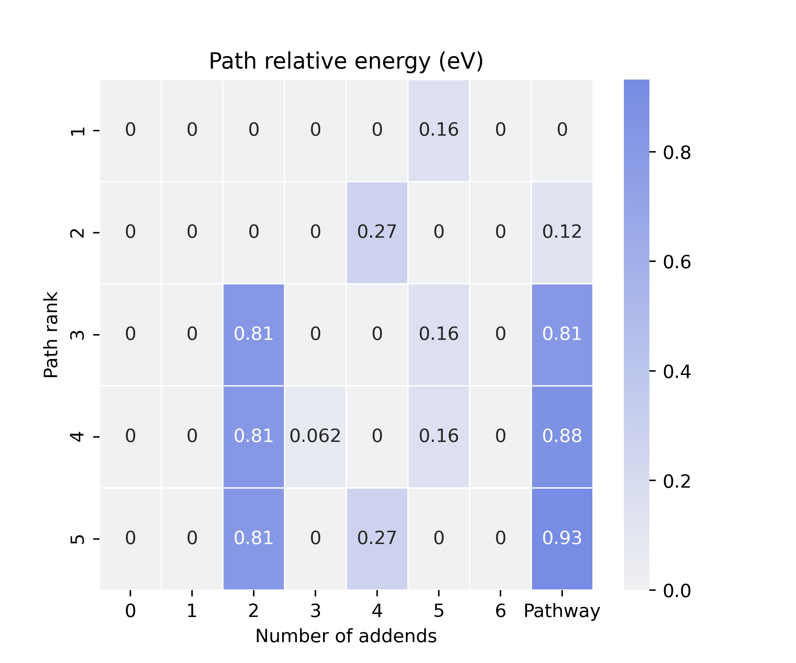
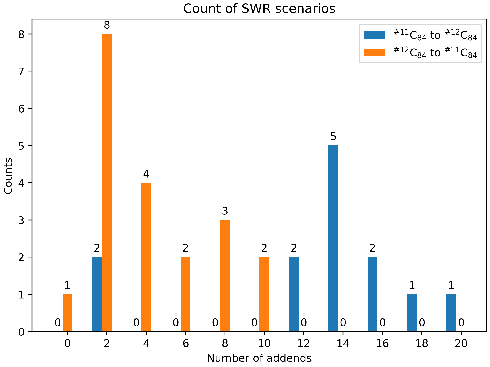

Analysis Functions
==================

Cook disordered
---------------

Before hands-on with the Pathway or SWR pipelines, please be patient
with this gentle introduction about the ``cook_disordered`` function.
The SWR, binding energy and part of the Pathway analysis are built on
top of this function. Since it’s convenient to use, the results are
highly informative and structural.

It was July 2022, we were working on the pathway analysis. Initially, we
performed the routine refinement procedure of pathways. That is, start
from the 10-kilo NNP pathways to the 1-kilo xTB pathways and finally
come to the 100 DFT pathways. Back then, we are excited about what we
have found. However, after carefully reviewing our results, we found
that this refinement procedure is still not perfect. See Fig 1. From a
topological view, the C60Cl4-2 adduct is the same as C60Cl4-1. However,
when it comes to pathway search, only C60Cl4-1 will take accounted as
one of the C60Cl6 precursors, meanwhile, C60Cl4-2 will be thrown away.
Although this scenario will not happen because we have adopted usenauty
to enumerate non-isomorphic patterns. The point is that some topological
information has been lost during the simulation procedure, resulting in
connections like C60Cl6 and C60Cl4-2 will never be considered in the
later analysis workflows.

.. raw:: html

   

Fig 1. The problem of pathway search.

.. raw:: html

   

To properly address this problem, we developed the ``get_connection``
function to **re-generate** topological information for a small batch of
isomers (by `NetworkX
Isomorphism <https://networkx.org/documentation/stable/reference/algorithms/isomorphism.html>`__
module). Since this function requires highly structured inputs, we
developed the ``simple_parse_logs`` function to properly **parse and
sort** legacy simulation data. Following these two functions, a
**pathway search** program is immediately developed. Fig 2 sums up the
cook_disordered pipeline and its capabilities. Since most of the
computation cost comes from the ``get_connection`` function for solving
sub-graph isomorphism problems, we **do not recommend** applying this
function for huge batches of isomers. 100 or some DFT results will be
acceptable.

.. raw:: html

   

Fig 2. The cook_disordered pipeline and its capabilities.

.. raw:: html

   

To use it, one needs to provide the following parameters:

-  ``disordered_root``: path to the disordered root. It could be any of
   your legacy DFT (xTB) results, simply copying and pasting them to one
   folder and naming this folder ``disordered_root`` will be good. Note
   that, equal addon intervals are required. It could be 1_addons,
   2_addons or 2_addons, 4_addons. The program will be broken for 1, 2,
   4 scenarios.
-  ``step``: the step, the addon interval.
-  ``file_mid_name``: to customize the filename (optional). Currently,
   the filename convention consists of two info. For example,
   2_addons_2, 1 means the number of addends, 2 means this isomer ranks
   2 in all considered C2nX2. This parameter will insert new flags into
   the name convention. For example, if ``file_mid_name=xtb_rank``, the
   results could be ``2_addons_xtb_rank_2``. The phase ``addons`` is a
   fixed mid filename.
-  ``dump_root``: path to dump information.
-  ``keep_top_k_pathway``: how many generated pathways to keep. (in rank
   mode)
-  ``log_mode``: two log formats are supported. 1. the Gaussian format,
   type the keyword ``gauss``. 2. the xyz format, type the keyword
   ``xtb``.
-  ``has_pathway``: set false to skip pathway generation. By default,
   this is true, since pathway search on a small batch of isomers is
   extremely easy.

For an example, see
`cook_disordered <https://github.com/Franklalalala/AutoSteper/tree/master/gym/analysis/cook_disordered>`__.
Fig 3 presents the ``cook_disordered`` results. The ``sorted`` folder
contains the structured information we need for SWR analysis or binding
energy analysis.

.. raw:: html

   

Fig 3. The cook disordered workbase.

.. raw:: html

   

It contains the following results:

-  ``./sorted/log``: the final (typically) optimization logs for a
   specific isomer. File names contain two metrics. The first number
   means the number of addends, the last number means the ranking of the
   specific isomer. For example, ``1_addons_1`` means it contains 1
   addend and its energy rank is 1 (the lowest energy one).
-  ``./sorted/xyz``: the final image of the optimization trajectory. The
   name convention is the same as above.
-  ``./sorted/info``: energy information. (in pickle and excel format)
-  ``./sorted/connection``: connection information. ``1_addons_1.npy``
   corresponds to the isomer, whose geometry information is stored in
   ``1_addons_1.xyz``. This isomer has connection relationships with
   higher addends, here, in this case, it means 2 addends.
   ``1_addons_1.npy`` stores this information, 1 meaning connected, 0
   for not.

**Note that**, if one is pursuing numerical addon labels like 1_2_31,
please check ``Plot_With_FullereneDataParser``. It will give a better
visualization.

Path parser
-----------

The development of the path parser abstraction started from the very
beginning of AutoSteper. It was noted that when a pattern “**gives birth
to**” a new pattern, there exists **a topological bond** between the
two. For example, an isomer with an addon pattern [0, 1] may have a
derivative with an addon pattern [0, 1, 3]. This corresponds to the
``step`` mode of usenauty module. During the build-on-the-fly procedure,
this kind of topological information will be stored as a by-product of
the growth simulation. Here we name this kind of information as
**parent-son** information and store it in the ``parent_info.pickle``.
The early version of the pathway search program is built to parse this
information. With no need to generate topological connection
information, this program is extremely fast. However, as mentioned in
the previous section, the parent-son information is incomplete from the
topological view, whereafter we built another pathway search program
based on the **re-generated** connection information (by `NetworkX
Isomorphism <https://networkx.org/documentation/stable/reference/algorithms/isomorphism.html>`__
module), yet this program can only be applicated to a small batch of
isomers since solving subgraph isomorphism problem is expensive.

The programs mentioned above have been wrapped into a single
abstraction, ``Path_Parser``. Next, we present an introduction to each
of its methods.

get_path_from_sim
~~~~~~~~~~~~~~~~~

This method will parse simulation-generated **parent_son** information.
One may follow the script below:

.. code:: python

   import os

   from autosteper.parser import Path_Parser

   a_path_parser = Path_Parser()
   a_path_parser.get_path_from_sim(dump_root=r'path/to/sim_pathways',
                                   pristine_cage_path=r'path/to/C60.xyz',
                                   sim_workbase=r'path/to/C60',
                                   sim_step=1, sim_start=1, q_add_num=6, q_path_rank=5, q_isomer_rank=3,
                                   is_mix=True)

Here is a short explanation of each parameter:

-  ``dump_root``: which folder to dump
-  ``pristine_cage_path``: path to pristine cage
-  ``sim_xx``: simulation-related parameters, same as the run
   parameters.
-  ``q_xx``: query atoms related parameters. To start with, the formula
   :math:`\rm C_{2n}X_{m}\_i` is for the isomer of cage size 2n, addon
   number m, and energy rank i. For pathway search of it, one may type
   keywords ``q_add_num=m``, and ``q_isomer_rank=i``. The cage size 2n
   has been calculated from the pristine cage. ``q_path_rank`` means how
   many pathways to dump, in the format of heatmap and xyz files.
-  ``is_mix``: this parameter is for the query of multiple
   end-addition-state isomers. By default, this parameter will be false.
   The query will be focused on a specific end-addition-state isomer.
   Set this parameter to true will enable query for all
   :math:`\rm C_{2n}X_{m}\_i, i<=q\_isomer\_rank` isomers.
-  ``is_ctr_path``: set this parameter to true to control the scale of
   pathways. As mentioned above, the pattern [0, 1, 3] may have a parent
   pattern [0, 1]. In fact, there may exist another parent pattern [0,
   3], which is NOT isomorphic with [0, 1]. Both of them will give birth
   to [0, 1, 3]. Therefore, pattern [0, 1, 3] will have two parents.
   This is the key to controlling the number of generated pathways.
   Since ``get_path_from_sim`` is a **DFS program**, limiting the number
   of parents will bring the pathway search manageable. The parameter
   ``ctl_parent_num`` will clean the parent_info.pickle file by sorting
   parents with energy rank and throwing away high-energy parents.
   Additionally, the parameter ``max_path_num`` will set an upper limit
   to the ``raw_pathway_info.pickle`` file. These parameters are helpful
   for query isomers with high addends, say 20 or 30. The results may
   reach half a million. It’s recommended to set ``ctl_parent_num`` as 2
   or 1 and set ``max_path_num`` to 10000.

The results of this method are presented below:

.. raw:: html

   

Fig 4. Folder system for get_path_from_sim results.

.. raw:: html

   

The folder system has been refactored recently for a general readership.
For each pathway result P_i, i <= q_path_rank, there will be a unique
folder named path_rank_i created. This folder lists pathway-related
isomers in xyz format. And a log file for dynamic visualization. (ASE
GUI)

The energy differences between pathways and isomers are summed up into
the heatmap:

.. raw:: html

   

Fig 5. Heatmap for visualization of pathways.

.. raw:: html

   

In this heatmap, each row is a unique pathway, and columns on the
sub-figure Isomer mean the number of addends. The split column is for
the relative energy of pathways. It is indeed the sum up of the left
sub-figure, though it has deviated from our original planning. As one
may notice in the ``raw_pathway_info.xlsx``, the name of this column is
**e_area**. This is the deprecated name of ‘Pathway’ in Fig 5. In fact,
we are planning to compare different pathways by the surrounding area
like activation energy curves in catalyst research initially, see Fig 6.

.. raw:: html

   

Fig 6. Illustration of the e-area concept.

.. raw:: html

   

It’s much more convincing for the general readership if we compare
pathways by area. An area solver is quickly developed, say, we add two
triangles surrounded by the first and last relative E, as well as the
trapezoids surrounded by intermediates. We will have equation (1) as
below. Here we set the base of a triangle and the height of a trapezoid
to a constant :math:`C`.

.. math::

   \begin{alignat}{2}P_{area} & = E_1\times \frac{C}{2} +\sum_{i=2}^{max}(E_i+E_{i-1}) +E_{max}\times \frac{C}{2} \\& = \frac{C}{2}\sum_{i=1}^{max}E_i  \end{alignat}

Here equation (1) is simplified to equation (2). So, after a whole
roundabout, we come back to the criterion of a simple sum up.

update_path_info
~~~~~~~~~~~~~~~~

Humanity’s pursuit of computational accuracy is never-ending. Here for
the pathway search scenario, the update of evaluators may be desired.
For example, from NNP to xTB, and then, from xTB to DFT.

To do this, one may follow the script below, input parameters are easy
to understand:

.. code:: python

   import os

   from autosteper.parser import Path_Parser

   refiner_para = {autosteper.optimizer parameters}

   a_path_parser = Path_Parser()
   a_path_parser.update_path_info(old_workbase=r'path/to/sim_pathways',
                                  new_workbase=r'path/to/updated_sim_pathways',
                                  refine_top_k=4,
                                  refine_mode='xtb',
                                  refiner_para=refiner_para)

This will update pathway info with a higher level of computation method.

re_generate_pathways
~~~~~~~~~~~~~~~~~~~~

After the multi-level refinement procedure, there would be much fewer
pathways on hand. As mentioned in the ``cook_disordered`` section, we
are capable to do a complete pathway search with all the topological
connections considered. Therefore, this method is a simple wrapper of
``cook_disordered`` function. To use it, one may follow the script as
below:

.. code:: python

   import os

   from autosteper.parser import Path_Parser

   a_path_parser = Path_Parser()
   a_path_parser.re_generate_pathways(old_workbase=r'path/to/updated_sim_pathways',
                                      new_workbase=r'path/to/regenerated_pathways',
                                      step=1, last_log_mode='xtb', keep_top_k_pathway=3, group='Cl')

**Note that**, the re-generated pathway may look disordered in terms of
numerical labels. For example, a pattern [0, 1] can have a son [1, 2,
3]. For a general readership, the filename convention of re-generated
pathways follows the ``1_addons_1`` as mentioned above. For a better
visualization, please check the ``PlotWithFullerneDataParser`` section.

The recommended workflow
~~~~~~~~~~~~~~~~~~~~~~~~

Here in Fig 7, we present the recommended workflow for pathway search.

.. raw:: html

   

Fig 7. The recommended pathway search workflow.

.. raw:: html

   

That is:

1. Perform a growth simulation with AutoSteper to get enough
   intermediates for the queried atoms.
2. Get pathways from topological information generated along with the
   simulation.
3. Update evaluators to a higher computational method. This procedure
   may be performed repeatedly.
4. Re-generate complete topological information and perform a complete
   pathway search within remaining isomers.
5. Visualize pathways with FullereneDataParser_Plotter.

SWR analysis
------------

The Stone-Wales rearrangement (SWR) in fullerene chemistry is like gene
mutation in biology. A SWR takes place on a cage means there is at least
one C-C bond that takes a 90° rotation, and changes this cage to a more
chemically active or stable one. As gene mutation does for DNA.

It has been a widely observed phenomenon that functional groups could
significantly activate the **to-be-rotated C-C bond.** Based on this
observation, we developed an SWR search program. Specifically, we focus
on the **mid-addition stage**. Two topological rules and one energy
criterion have been established to screen the possible SWR scenarios.
For description convenience, here we denote an isomer before and after
the SWR as :math:`\rm ^{\#1}C_{2n}Cl_{2m}` and
:math:`\rm ^{\#2}C_{2n}Cl_{2(m+1)}`.

That is:

1. At least one of the four sites around the rotated C-C bond should be
   occupied during the SWR process.
2. The :math:`\rm ^{\#1}C_{2n}Cl_{2m}` structure should be a subgraph of
   :math:`\rm ^{\#2}C_{2n}Cl_{2(m+1)}` when excluding the rotated C-C
   bond.
3. The :math:`\rm ^{\#1}C_{2n}Cl_{2m}` may have multiple SWR products
   :math:`\rm ^{\#2}C_{2n}Cl_{2(m+1)}`, the lowest energy one should
   have lower energy than the competitive
   :math:`\rm ^{\#1}C_{2n}Cl_{2(m+1)}` products. (Optional)

Note that, in the practical SWR search, there are much more tricky
exceptions to be dealt with. Almost all of them came from **unexpected
isomorphism problems.** Fig 8 presents two of the screened SWR results:

.. raw:: html

   

Fig 8. Visualization of the isomorphism problem.

.. raw:: html

   

There is indeed one SWR step between cage :math:`\rm ^{\#11}C_{84}` and
:math:`\rm ^{\#12}C_{84}`. However, from a topological view, there are
two SWR pairs found to exist. Or in other words, these two pairs point
to the same C-C bond rotation, but in different labels.

After careful refactoring and extensive testing, in the latest version
of AutoSteper, this problem has been fixed. And an automated pipeline
has been built to wrap the whole SWR analysis into a single function.
Although we still recommend users read through the inner part of this
pipeline to get a more general view.

find SWR
~~~~~~~~

This is the main SWR search program, it was designed as follows:

1. map pristine cages to find SWR pairs (on the cage level).
2. map the target system to the query system with two topological rules
   and one energy criterion considered.
3. re-label the target system (shuffle carbon atoms) to have an
   identical carbon sequence except for the SWR sites. This is for the
   visualization convenience.

To applicate this program, the ``cook_disordered`` function is required
to have structural information prepared.After that, one may follow the
script below:

.. code:: python

   import os

   from autosteper.parser import find_SWR

   find_SWR(q_sorted_root=r'./cook_disordered_results/11_C84_cooked',
            tgt_sorted_root=r'./cook_disordered_results/12_C84_cooked',
            swr_dump_path=r'./q_11_to_tgt_12',
            is_unique=True,
            is_low_e=True)

Two of the parameters need to be taken carefully:

-  ``is_low_e``: set true to enable an energy criterion
-  ``is_unique``: set true to keep only one SWR product

The SWR results are highly structured, see Fig 9:

.. raw:: html

   

Fig 9. Folder system for SWR search results.

.. raw:: html

   

From left to right:

-  ``14_to_16_swr_5``: this means the queried isomer has 14 addends
   while the target isomer has 16 addends. The final numerical label 5
   means the queried isomers have an energy rank of 5 among other
   queried isomers.
-  Note, for each queried isomer, there may be more than one target
   isomer that met the rules mentioned above. If the flag ``is_unique``
   is set to True, only one of the target isomers will be saved. (The
   lowest energy one) There are pictures to visualize this SWR pair, we
   will describe it later.
-  ``site_info.txt``: it stores detailed site information.

Count SWR
~~~~~~~~~

As one may notice, the SWR search results are kind of tricky to follow.
So, what can we do with this messy data?

Well, let’s start with the sub-folders in Fig 10, one may notice that,
there are more than one SWR pairs detected from
:math:`\rm ^{\#11}C_{84}Cl_{14}` and :math:`\rm ^{\#12}C_{84}Cl_{16}` (5
in total). That is, 5 :math:`\rm ^{\#11}C_{84}Cl_{14}` lowest energy
isomers will have a tendency to transform to
:math:`\rm ^{\#12}C_{84}Cl_{16}`. Simply counting these numbers will
give a general view. Additionally, :math:`\rm ^{\#11}C_{84}` could
transform to :math:`\rm ^{\#12}C_{84}`, then, how about the reverse,
:math:`\rm ^{\#12}C_{84}` to :math:`\rm ^{\#11}C_{84}`? If we search SWR
pairs for both scenarios and compare them. This will reveal new insights
into the interplay.

Considering that, we developed a simple counting program ``count_SWR``
to compare SWR between two systems.

To use this function, one needs to provide the following parameters:

-  ``swr_1_legend``: legend of the ``swr_1``
-  ``swr_2_legend``: legend of the ``swr_2``
-  ``swr_1_workbase``: output of ``find_SWR``
-  ``swr_2_workbase``: same
-  ``dump_pic_path``: absolute path to the final picture.

For script, see `SWR
example <https://github.com/Franklalalala/AutoSteper/tree/master/gym/analysis/SWR>`__.

Here is an example of an SWR count. It compares the SWRs between
:math:`\rm ^{\#11}C_{84}Cl_x` and :math:`\rm ^{\#12}C_{84}Cl_{x+2}`. For
example, in the x=2 stage, there are 8 SWRs detected from
:math:`\rm ^{\#11}C_{84}Cl_2` to :math:`\rm ^{\#12}C_{84}Cl_4`, and when
it comes to the post-addition stage, this number went to zero.

.. raw:: html

   

Fig 11. Illustration of SWR counts.

.. raw:: html

   

.. _the-recommended-workflow-1:

The recommended workflow
~~~~~~~~~~~~~~~~~~~~~~~~

Here in Fig 12, we present the recommended workflow for SWR analysis.

.. raw:: html

   

Fig 12. The recommended workflow for SWR analysis.

.. raw:: html

   

That is:

1. Perform growth simulation on two pristine cages with AutoSteper.
2. After refinement of simulation results, **re-generate** topological
   linkage information with ``cook_disordered`` function.
3. Send structured results to the SWR pipeline to **find, plot, and
   count** SWR pairs.

Refine
------

When one needs to improve computational accuracy for growth simulation,
the ``refine`` function in the ``parser`` module presents a nice
solution. Only 3 parameters are needed to perform a refinement
procedure. That is:

-  ``old_workbase``: the original workbase.
-  ``new_workbase``: the new workbase.
-  ``ref_para``: the same format as the optimizer’s parameter to
   configure an optimizer.

That’s it. AutoSteper will refine the original data and dump them into
the new workbase. For details, see
`test_refine.py <https://github.com/Franklalalala/AutoSteper/blob/master/gym/analysis/refine/test_refine.py>`__.

Isomorphism test
----------------

AutoSteper provides 3 functions to perform the isomorphism test. For
example, see
`isomorphism <https://github.com/Franklalalala/AutoSteper/tree/master/gym/analysis/isomorphism>`__.

Details are presented below:

simple_test_iso
~~~~~~~~~~~~~~~

This function is designed to test whether a specific isomer
:math:`\rm ^{\#M}C_{2n}X_{m}` is within the simulation results
:math:`\rm ^{\#M}C_{2n}X_{m}\_q,0<q<=max\_rank`. If it’s indeed within
the results, this function will output its corresponding rank
:math:`\rm q`. One needs to provide:

-  ``q_atoms``: the queried isomer, in `ASE Atoms
   format <https://wiki.fysik.dtu.dk/ase/ase/atoms.html#module-ase.atoms>`__.
-  ``passed_info_path``: the absolute path to the queried
   ``passed_info.pickle``.
-  ``top_k``: a cutoff performed on the ``passed_info.pickle``, ``rank``
   mode only. If none, AutoSteper will scan all the simulation results.

simple_log_relatives
~~~~~~~~~~~~~~~~~~~~

This function is designed to quickly find relatives of a specific isomer
:math:`\rm ^{\#M}C_{2n}X_{m}` and log key information to a writeable
path. Here relatives mean the intermediates
(:math:`\rm ^{\#M}C_{2n}X_{q}, q<m`), isomer
(:math:`\rm ^{\#M}C_{2n}X_{q}, q=m`) and derivatives
(:math:`\rm ^{\#M}C_{2n}X_{q}, q>m`) of the queried isomer. To ensure a
fast test, here use the addition patterns as a criterion.

Two ways to decide the queried addition pattern.

-  The recommended way to get the addition pattern:

   -  ``q_atoms``: the queried isomer, in `ASE Atoms
      format <https://wiki.fysik.dtu.dk/ase/ase/atoms.html#module-ase.atoms>`__.
      Note that, it needs to have an identical pristine cage to the
      target. This ensures an identical sequence.

   -  ``group``: the symbol of the functional group.

   -  ``cage_size``: the size of the pristine cage.

-  The second way to get the addition pattern:

   -  ``q_seq``: the 36-base format name. See `the 36 base
      function <https://github.com/Franklalalala/AutoSteper/blob/18f474b0dd58adc9cd7484007a14927e2cde5123/src/autosteper/cage.py#L59>`__.

   -  ``q_cage``: the key to decipher the 36-base name to a sequence, in
      `AutoSteper/cage <https://github.com/Franklalalala/AutoSteper/blob/18f474b0dd58adc9cd7484007a14927e2cde5123/src/autosteper/cage.py#L11>`__
      format.

After that, one needs to provide:

-  ``fst_add_num``: the smallest addon number to be scanned.
-  ``final_add_num``: the biggest addon number to be scanned.
-  ``step``: the step that used in the growth simulation.
-  ``workbase``: the original workbase.
-  ``dump_log_path``: the absolute path to dump the related information.

`Here <https://github.com/Franklalalala/AutoSteper/blob/master/tests/test_iso_relatives/rel.log>`__
is an example of the dumped log.

strict_scatter_relatives
~~~~~~~~~~~~~~~~~~~~~~~~

This function is designed to strictly find relatives of a specific
isomer. It implements the
`subgraph_is_isomorphic <https://networkx.org/documentation/latest/reference/algorithms/generated/networkx.algorithms.isomorphism.GraphMatcher.subgraph_is_isomorphic.html#graphmatcher-subgraph-is-isomorphic>`__
function to perform the isomorphism test and dump information in a png
format (see Fig 13). The input parameters are basically the same as the
above function. The difference is that it needs a folder to dump
information.

.. image:: ./fig/iso_rel_e.png
   :alt: iso_rel_e
   :align: center

.. raw:: html

   

Fig 13. Example of the dumped information. The red ‘x’ presents a
relative, blue ‘+’ is a non-isomerphic one.

.. raw:: html

   

In addition, AutoSteper dumps the relative energy of each scanned
isomer, and groups them into the ``non_rel_e`` and ``rel_e``.

Collect failed
--------------

The failed-check optimization jobs are collected into the
``failed_job_paths`` file. To have an overview of failed job types, call
function ``clc_failed``.

Three parameters are required:

-  ``workbase``: where the simulation is performed, see section
   ``SimulationModules`` Fig 2.
-  ``dump_pic_path``: where the collected information dumps, an absolute
   root to a picture.
-  ``ylim``: Optional parameter. For users who are interested to set an
   upper limit of the y-axis.

Fig 14 presents a collected distribution of failed jobs, it was
performed with :math:`\rm C_{60}Br_x` systems, 50 isomers for x = 3, 6,
9, 12, 15, 18 are sampled with AutoSteper’s random mode.

.. image:: ./fig/C60_ih_Br.png
   :alt: C60Brx
   :align: center

.. raw:: html

   

Fig 14. Distribution of failed jobs for a random simulation.

.. raw:: html

   

The legend on the upper left denotes the types of failed jobs. They are
corresponding to the 7 rules mentioned in the previous section. See
`clc_failed <https://github.com/Franklalalala/AutoSteper/tree/master/gym/analysis/clc_failed>`__.

Binding energy analysis
-----------------------

The binding energy well explains the reaction activity. Based on the
structured topological information provided by the ``cook_disordered``
function, one can easily parse the binding energy information. Set
hydrofullerene as an example, AutoSteper following this equation to
calculate binding energy.

.. math::

   E_{binding}=E_{C_{66}H_{2m}}-E_{C_{66}H_{2(m-1)}}-E_{H_2}

One needs provide the following parameters:

-  ``sorted_root``: the structured source folder.
-  ``cage_e``: the energy of the pristine cage.
-  ``addends_e``: the energy of the simple substance of addons. Here in
   this case, its Hydrogen.

Note that, the ``cage_e`` and ``addends_e`` need to be calculated under
the same computational level as the general isomers.

The output of this function is dumped into the ``sorted_root/info/``, in
the format of ``pickle`` and ``xlsx``. For an example, see
`binding_e <https://github.com/Franklalalala/AutoSteper/tree/master/gym/analysis/binding_e>`__.
