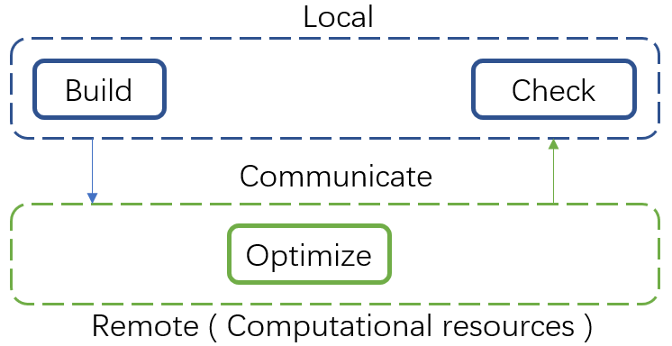

Installation
============

AutoSteper has a dependency on multiple projects, namely:

-  importlib-metadata
-  ase
-  numpy
-  pandas
-  networkx
-  tqdm
-  matplotlib>=3.6.0
-  seaborn
-  openpyxl
-  DPDispatcher
-  FullereneDataParser
-  usenauty

The installation pipeline has been optimized with our best efforts.
Before hands-on, a gentle notation about wisely choosing the working
platform needs to be addressed.

Choose your platform
--------------------

AutoSteper is designed to simulate the stepwise chemical reaction.
Generally speaking, there are three minor steps in each step. As
presented in Fig 1, the computation-intensive operation ``Optimize`` has
been isolated to the *Remote* resources, and the other two are conducted
in *Local* resources. AutoSteper relies on
`DPDispatcher <https://docs.deepmodeling.com/projects/dpdispatcher/en/latest/index.html>`__
to realize the communication between the two. Here local and remote are
virtual concepts to emphasize the isolation of computation-intensive
operations.

.. raw:: html

   

Fig 1. Illustration of the communication scheme in AutoSteper.

.. raw:: html

   

In general, the remote resources are HPCC(High-Performance Computing
Cluster), which is accommodated with the Linux operation system, while
the local resource could be your PC(Personal Computer), a Windows
system, or stay in line with the remote.

Here we **recommend** setup all your workbase on the Linux platform,
since the communication between HPCC with PC may undermine performance.
Though you can set up a Windows version to perform some analyzing tasks.

For Linux users
---------------

Before hands-on to AutoSteper, an isolated conda environment is
encouraged:

::

   conda create -n AutoSteper python=3.8
   conda activate AutoSteper

We have put our project on `Pypi <https://pypi.org/>`__, to install this
project along with most of the dependencies has been integrated into a
single command line:

::

   pip install autosteper

The rest two packages, FullereneDataParser and usenauty, have not been
published on `Pypi <https://pypi.org/>`__. According to `Pypi
policy <https://setuptools.pypa.io/en/latest/userguide/dependency_management.html#direct-url-dependencies>`__,
the unpublished project **could not** be used as a dependency for the
published package. Therefore, the rest two of them need to be installed
separately.

Since both of these projects contains part of the C++ code, before
further installation, a C compiler needs to be prepared. For example:

::

   module load path/to/gcc/8.4.0

Here we **strongly recommend** users load the highest version of the
compiler that is available. Note that the
`usenauty <https://github.com/Franklalalala/usenauty>`__ project
requested a compiler that satisfies the `CXX 17
standard <https://en.wikipedia.org/wiki/C%2B%2B17>`__. A satisfied
compiler will avoid most of the installation problems, though a lower
version of compiler may work with instructions in
`usenauty <https://github.com/Franklalalala/usenauty>`__.

`FullereneDataParser <https://github.com/XJTU-ICP/FullereneDataParser>`__
has been utilized in this project to convert 3D coordinates into
graph6str format and properly visualize isomers, pathways, and SWR
pairs.
`FullereneDataParser <https://github.com/XJTU-ICP/FullereneDataParser>`__
is developed by XJTU-ICP member Y.B. Han, see
`article <https://pubs.rsc.org/en/content/articlelanding/2022/CP/D2CP03549A>`__.

To install this project:

::

   pip install git+https://github.com/XJTU-ICP/FullereneDataParser

Finally, the in-house built C++ project
`usenauty <https://github.com/Franklalalala/usenauty>`__ needs to be
collected. `usenauty <https://github.com/Franklalalala/usenauty>`__ is a
lightweight tool to enumerate non-isomorphic addition patterns with
`nauty <https://doi.org/10.1016/j.cpc.2020.107206>`__ algorithm which is
created by Brendan D. McKay, see
`article <https://doi.org/10.1016/j.jsc.2013.09.003>`__. The original
modification is performed in
`usenauty <https://github.com/saltball/usenauty>`__ by XJTU-ICP member
Y. B. Han. Here we employ a branch version of it.

If you have loaded a gcc with a version higher than gcc-8.4.0, you can
directly download the binary file:

::

   wget https://github.com/Franklalalala/usenauty/releases/download/linux/cagesearch

After downloading, users need to assign execution permissions:

::

   chmod +x path/to/cagesearch

The absolute path of this file corresponds to the ``gen_core_path`` in
the generator module, as demonstrated in
`test_step.py <https://github.com/Franklalalala/AutoSteper/blob/b1ae14e734b2013628ffca241ab44eba6510f970/tests/test_step/test_step.py#L38>`__.
On the other hand, if you do not have compilers that meet the
requirement, you can follow compile instructions in
`usenauty <https://github.com/saltball/usenauty>`__.

After collecting all these packages, a gentle touch on these programs is
encouraged:

In Python environment:

::

   from autosteper import AutoSteper

If everything goes well, there will be normal terminations.

And the usenauty program:

::

   path/to/cagesearch

A notation will appear:

.. image:: ./fig/nauty_notation.png
   :alt: image-20221220010149410
   :align: center

.. raw:: html

   

Fig 2. The usenauty notation.

.. raw:: html

   

For Windows users
-----------------

Though we **do not recommend** users install in a Windows environment,
for potential analyzing convenience, a Windows version could be prepared
in the following way:

1. Prepare an isolated conda environment:

::

   conda create -n AutoSteper python=3.8
   conda activate AutoSteper

2. Install AutoSteper and FullereneDataParser:

::

   pip install autosteper
   pip install git+https://github.com/XJTU-ICP/FullereneDataParser

3. Get a binary release from `Releases ·usenauty
   (github.com) <https://github.com/Franklalalala/usenauty/releases>`__.
   Note that there are two pre-compiled releases, if you do not have a
   compiler met that requirement, please follow the instructions in
   `usenauty <https://github.com/saltball/usenauty>`__, or you can
   directly skip this part to reserve analyzing functions only.
