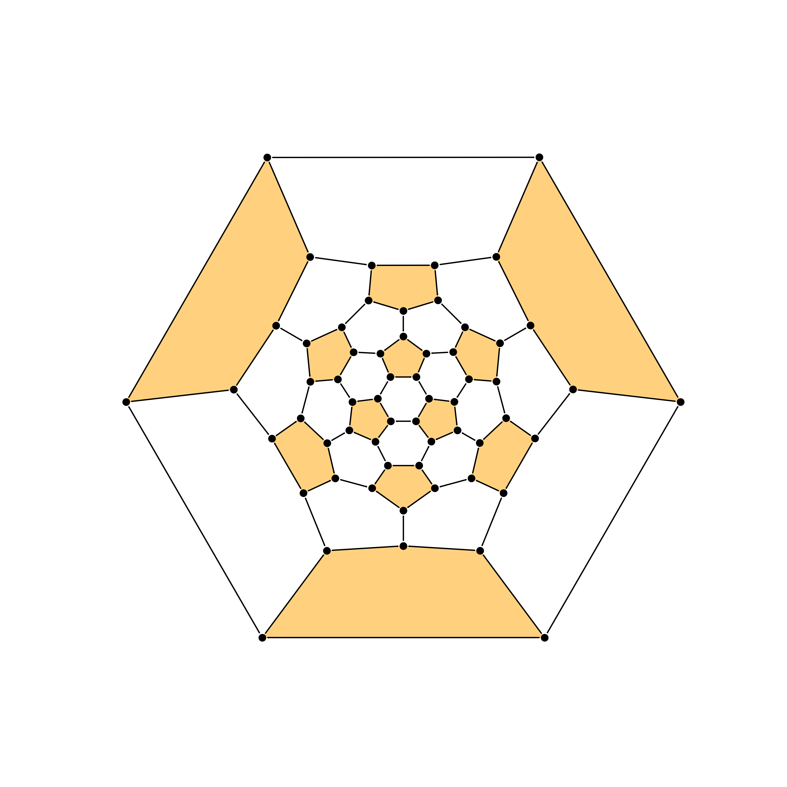
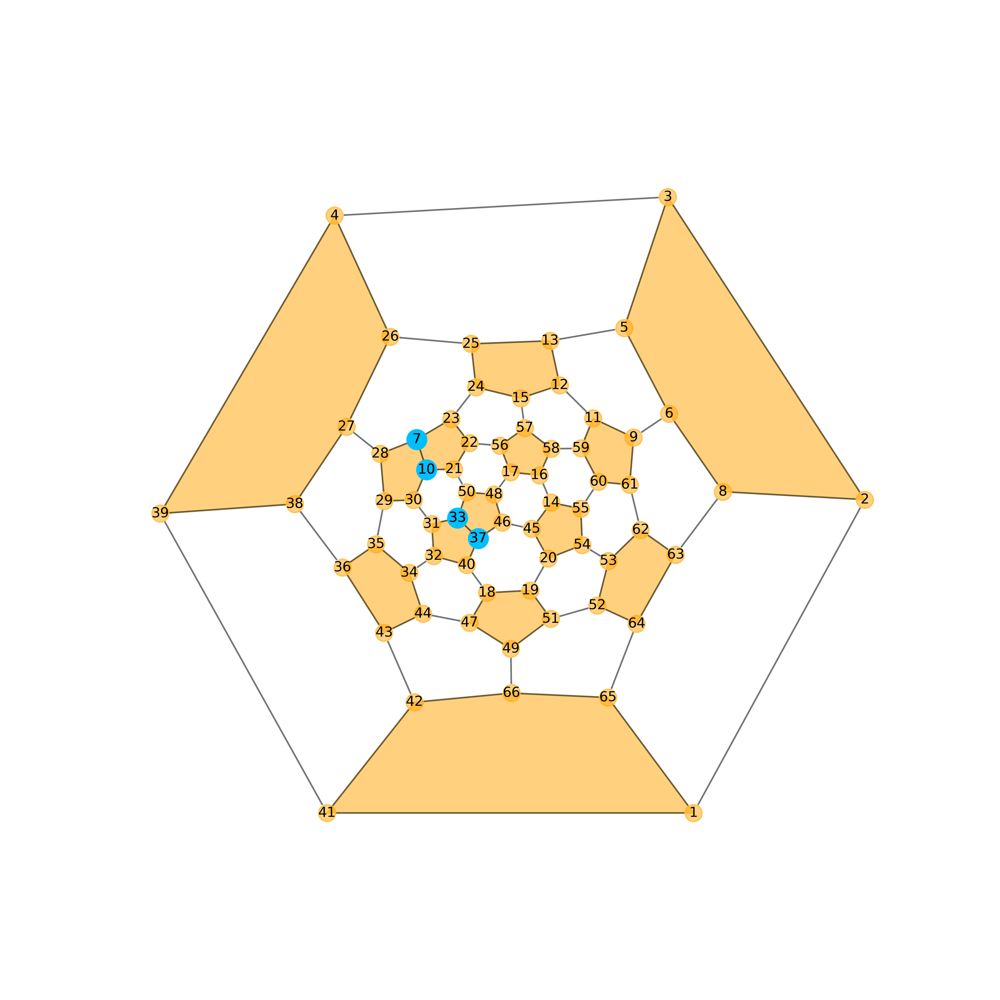
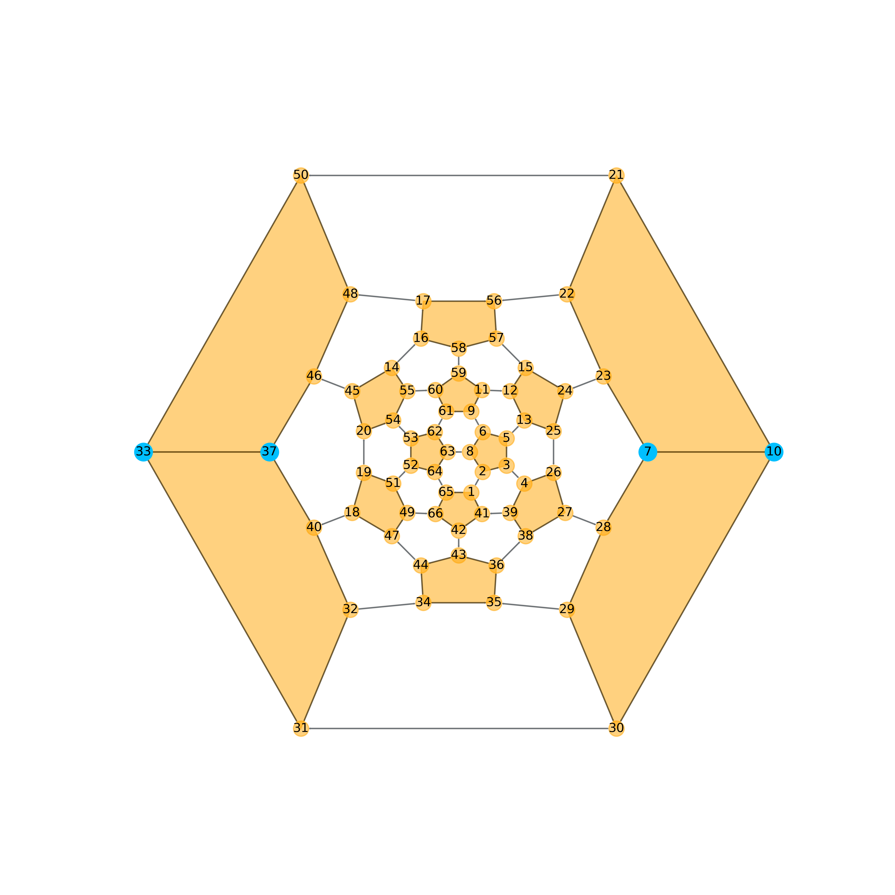
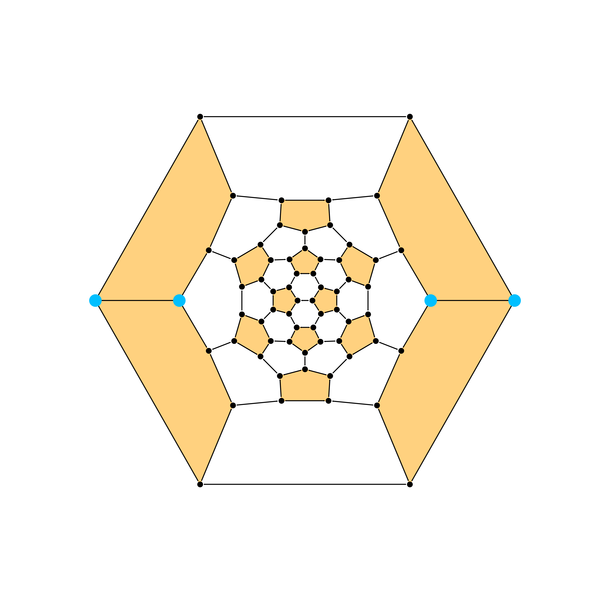
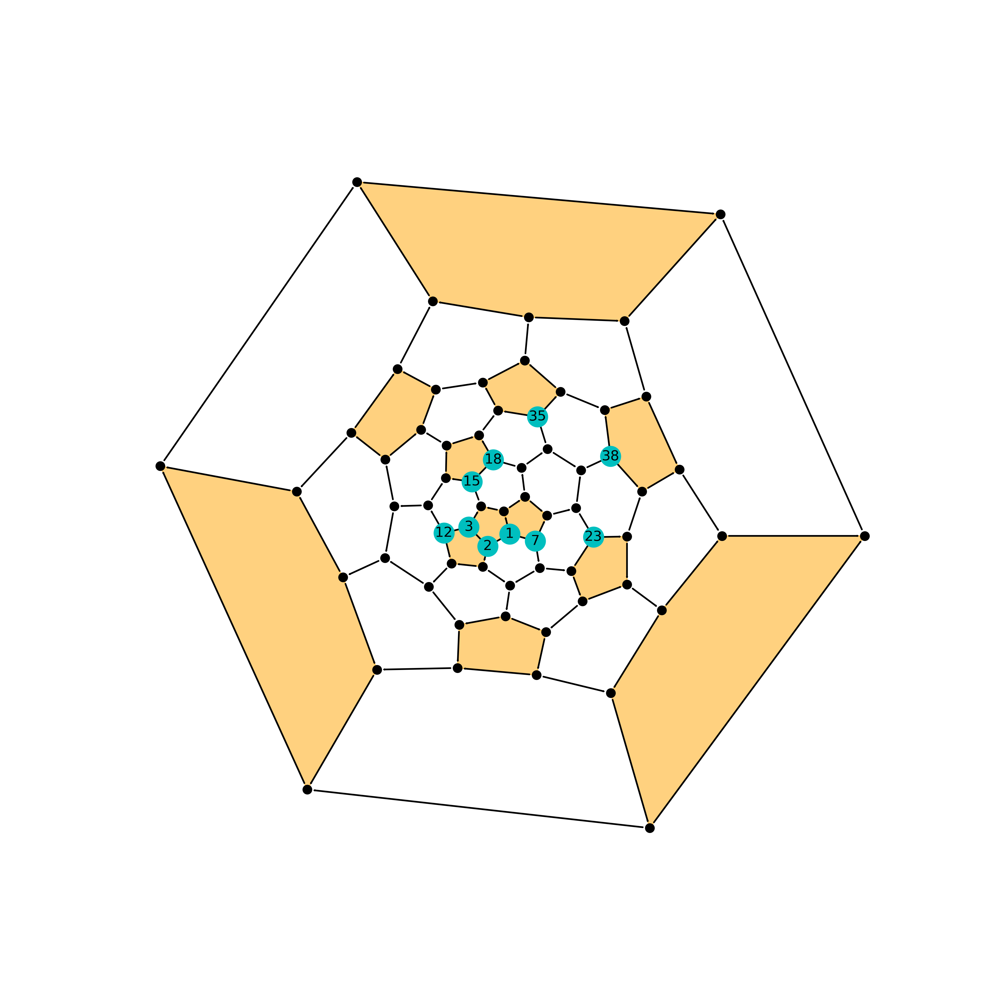
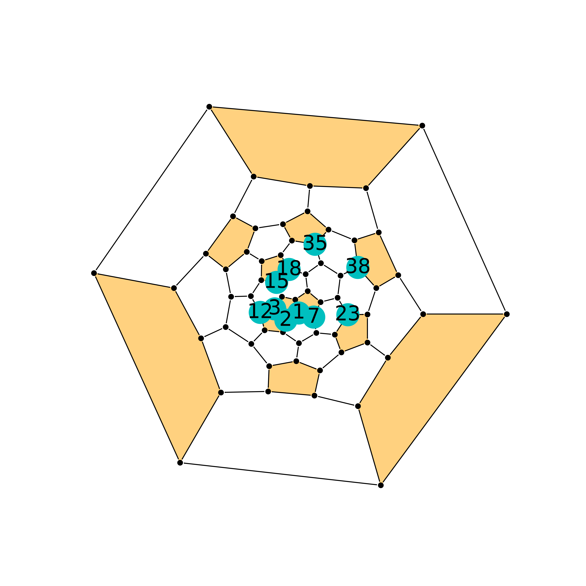
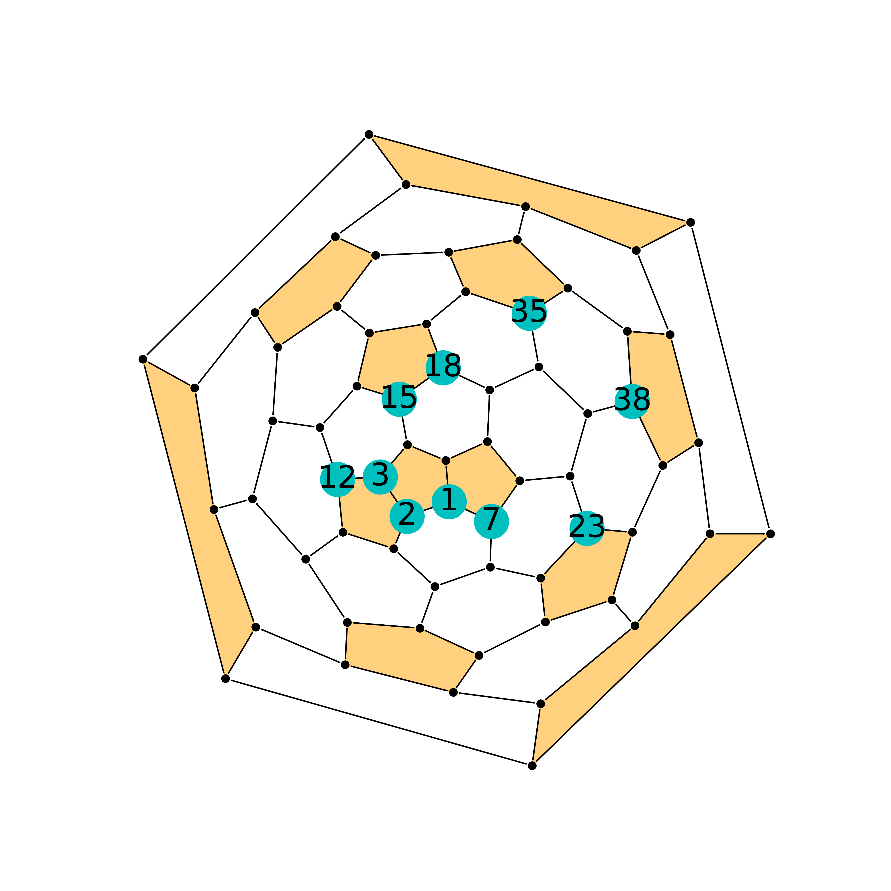
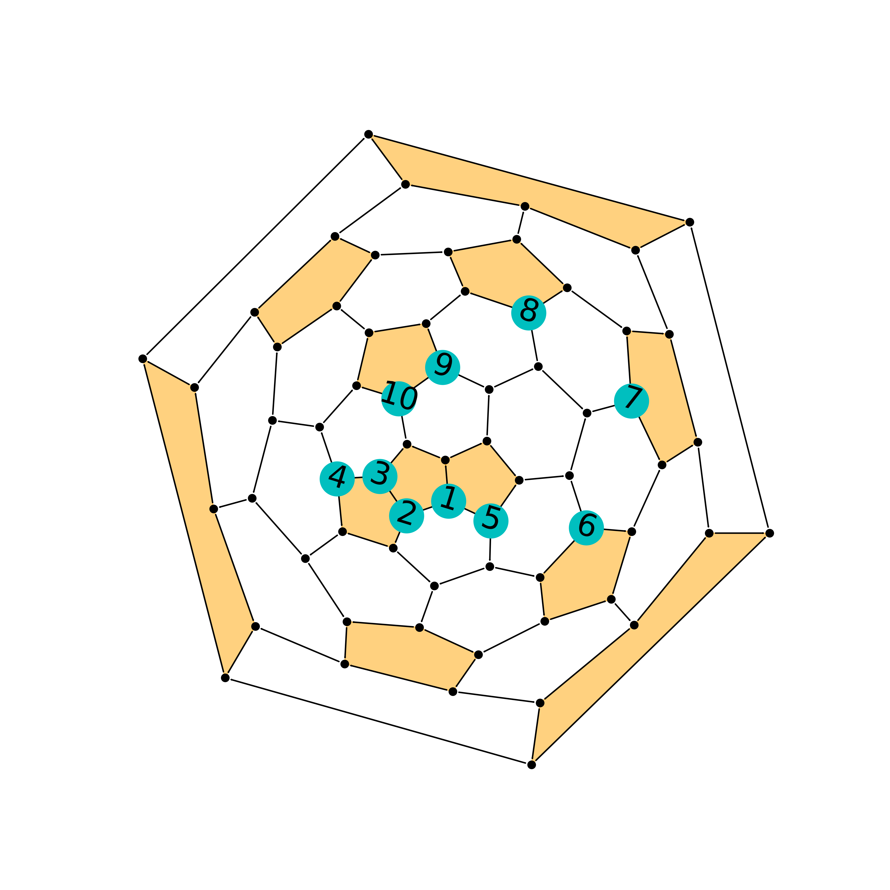
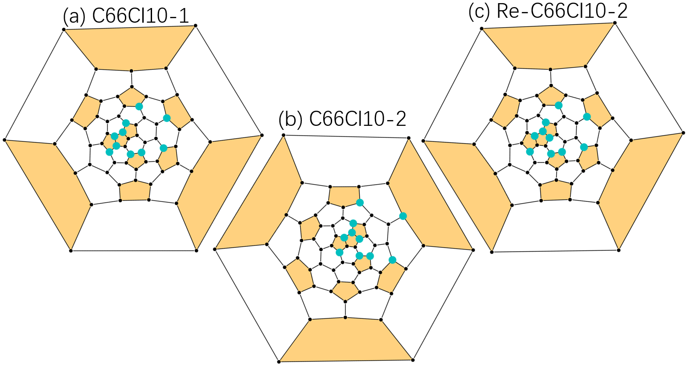
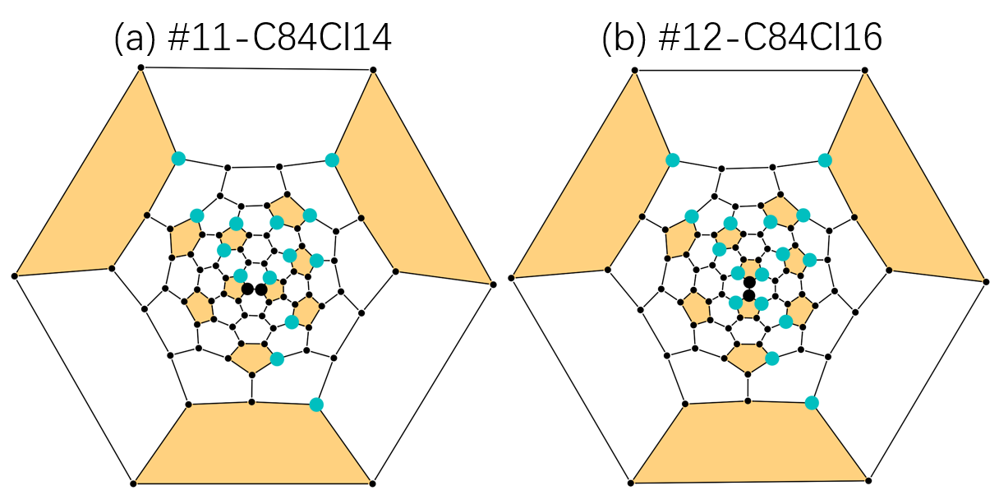

Plot with FullereneDataParser
=============================

This section is for the visualization of isomers, pathways, and SWR
pairs in Schlegel diagram format. The ``autosteper.plotter`` module is
built on top of
`FullereneDataParser <https://github.com/XJTU-ICP/FullereneDataParser>`__,
which is an excellent tool designed and maintained by Yanbo Han, a
XJTU-ICP member. A vivid description of FullereneDataParser could be
found in: DOI:10.1039/D2CP03549A (XCSI: “Effect of orbital angles on the
modeling of the conjugate system with curvature”).

.. note::

   Please cite the article: https://doi.org/10.1039/D2CP03549A, if ``autosteper.plotter`` is utilized in your work.

Basic usage
-----------

Plot a cage
~~~~~~~~~~~

Here is a standard workflow to plot a Schlegel diagram:

1. Prepare environment

::

   import matplotlib.pyplot as plt
   from autosteper.plotter import FullereneDataParser_Plotter

2. Prepare a coordinate containing object

A ``ase.Atoms`` object or a coordinate containing file:

::

   from ase.build.molecule import molecule

   C60 = molecule(name='C60')

3. Prepare a figure

This could be your customized figure, if this step is skipped, the
plotter will set up a new figure with the parameters in below:

::

   fig = plt.figure(figsize=[10, 10])
   ax = fig.add_subplot(111)

4. Load cage into the figure

::

   a_plotter = FullereneDataParser_Plotter()
   a_plotter.load_cage(atoms=C60, ax=ax)

5. Save the picture

::

   plt.savefig('customized_figure.png', dpi=400)
   plt.close()

See:

.. raw:: html

   

Fig 1. Schlegel diagram for C60.

.. raw:: html

   

Plot a C2nXm
~~~~~~~~~~~~

Here is a simple way to plot Schlegel diagrams for C2nXm isomers.

1. Prepare packages:

.. code:: python

   import matplotlib.pyplot as plt
   from autosteper.plotter import FullereneDataParser_Plotter
   from autosteper.tools import strip_extraFullerene

2. Get the pristine cage and addon sites sequence

.. code:: python

   pristine_cage, addon_set = strip_extraFullerene(coord_file_path=r'dihept_C66H4.xyz')

3. Load cage and addon_set

.. code:: python

   a_plotter = FullereneDataParser_Plotter()
   a_plotter.load_cage(atoms=pristine_cage)
   a_plotter.load_addons(addon_set=addon_set, group_symbol='H')

4. Save pictures

.. code:: python

   plt.savefig('simple_plot.png', dpi=400)
   plt.close()

See:

.. raw:: html

   

Fig 2. Schlegel diagram for C66H4.

.. raw:: html

   

Tailor your picture
-------------------

There are multiple parameters in methods ``load_cage`` and
``load_addons`` to help users to tailor the Schlegel diagram to their
own favor. Here present two cases to help users understand these
parameters.

Case 1: toggle projection ring
~~~~~~~~~~~~~~~~~~~~~~~~~~~~~~

As we all know, classical fullerenes have pentagons and hexagons rings.
The Schlegel diagrams are plotted by unzipping one ring and spreading
the rest of the rings to a planar like a graphene nanosheet. Here we
call the unzipped ring the projection ring. It will stay on the outmost
side of the Schlegel diagram, and **the opposite of this ring** on the
cage will become the center. FullereneDataParser can project from
pentagons and hexagons, however, it’s **not recommended** to project
from pentagons.

Here we take dihept-C66H4 for example. If not specified,
FullereneDataParser will randomly choose a hexagon to project from.
Result in Fig 2.

To specify a pleasant projection ring, one may start to see labels:

.. code:: python

   a_plotter.load_cage(atoms=pristine_cage, show_C_label=True, C_label_transparency=0.5, C_label_color='orange')
   a_plotter.load_addons(addon_set=addon_set, group_symbol='H', show_addon_nums=True)
   plt.savefig('plot_with_label.png', dpi=400)
   plt.close()

See:

.. raw:: html

   

Fig 3. Schlegel diagram with labels for C66H4.

.. raw:: html

   

As one may notice, the [10, 30, 31, 33, 21, 50] ring connected two
Adjacent Pentagon Pairs(APPs), to project from this ring will result in
a symmetrical diagram:

.. code:: python

   a_plotter.load_cage(atoms=pristine_cage, show_C_label=True, C_label_transparency=0.5, C_label_color='orange',
                       proj_ring_seq=[10, 30, 31, 33, 21, 50])
   a_plotter.load_addons(addon_set=addon_set, group_symbol='H', show_addon_nums=True)
   plt.savefig('re_plot_with_label.png', dpi=400)
   plt.close()

See:

.. raw:: html

   

Fig 4. Re-plot schlegel diagram for C66H4.

.. raw:: html

   

Note that, the outmost ring has changed to [10, 30, 31, 33, 21, 50].

Finally, clean this picture:

.. code:: python

   a_plotter.load_cage(atoms=pristine_cage, proj_ring_seq=[10, 30, 31, 33, 21, 50])
   a_plotter.load_addons(addon_set=addon_set, group_symbol='H')
   plt.savefig('Clean.png', dpi=400)
   plt.close()

See:

.. raw:: html

   

Fig 5. Clean schlegel diagram for C66H4.

.. raw:: html

   

.. tip::

   If you find this is too tricky, here we present the
   ``try_every_hexagon`` method. This will give all possible projection
   results. Feel free to pick your favorite! See
   `code <https://github.com/Franklalalala/AutoSteper/blob/master/gym/plot_with_FullerneDataParser/plot_C2nXm/plot_C2nXm.py#L23>`__
   and `result <https://github.com/Franklalalala/AutoSteper/tree/master/gym/plot_with_FullerneDataParser/plot_C2nXm/try_all_hexagons>`__.

Case 2: zoom in
~~~~~~~~~~~~~~~

As one may notice, pictures need to be scaled up for a pleasant view of
labels (Fig 4 and Fig 5). A straightforward way to avoid scaling up the
whole picture is to scale up fonts only. However, rings in the center
may be too crowded for this operation.

Here we take :math:`\rm ^{\#4169}C_{66}Cl_{10}` for example, to set
default labels:

.. code:: python

   pristine_cage, addon_set = strip_extraFullerene(coord_file_path=r'C66Cl10_4169_exp.xyz')

   a_plotter = FullereneDataParser_Plotter()
   a_plotter.load_cage(atoms=pristine_cage, proj_ring_seq=[61, 62, 63, 64, 65, 66])
   a_plotter.load_addons(addon_set=addon_set, group_symbol='Cl', show_addon_nums=True)

   plt.savefig('default.png', dpi=400)
   plt.close()

Labels are too small to see:

.. raw:: html

   

Fig 6. Default schlegel diagram for C66Cl10.

.. raw:: html

   

Scale up the font size and base circle:

.. code:: python

   a_plotter.load_addons(addon_set=addon_set, group_symbol='Cl', show_addon_nums=True, fontsize=25, addon_label_size=750)

.. raw:: html

   

Fig 7. Scale font size only for C66Cl10.

.. raw:: html

   

It’s hard to see rings behind labels. Note that, we are focusing on the
triple fused pentagons and the encircled hexagon in the center. However,
the outside pentagons took the majority of the picture. If we zoom in
like classical image processing tools, the center of the diagram will be
enlarged. Following this track, one step further is that we want to zoom
in on the center while squeezing outside rings.

To do that, one needs to toggle the ``sphere_ratio`` and ``parr_ratio``
parameters. The two of them control the shape of the outer object that
will be projected onto. Generally speaking, the center will be zoomed in
if ``sphere_ratio`` is high. By default, ``sphere_ratio=0.8`` and
``parr_ratio=0.2``. If we set ``sphere_ratio=6`` and do not change
``parr_ratio``. That is:

.. code:: python

   a_plotter.load_cage(atoms=pristine_cage, proj_ring_seq=[61, 62, 63, 64, 65, 66], sphere_ratio=6)

The center of this image will be zoomed in like this:

.. raw:: html

   

Fig 8. Zoom in for C66Cl10.

.. raw:: html

   

If one needs to replace these numbers with a more meaningful sequence
and rotate numbers to stay in line with the diagram,
``addon_nums_rotation`` and ``replace_addon_map`` may be helpful:

.. code:: python

   original_seq = [1, 2, 3, 12, 7, 23, 38, 35, 18, 15]
   new_seq = list(range(1, 11, 1))
   replace_addon_map = dict(zip(original_seq, new_seq))

   a_plotter = FullereneDataParser_Plotter()
   a_plotter.load_cage(atoms=pristine_cage, proj_ring_seq=[61, 62, 63, 64, 65, 66], sphere_ratio=6)
   a_plotter.load_addons(addon_set=addon_set, group_symbol='Cl', show_addon_nums=True, fontsize=25,
                         addon_label_size=750, addon_nums_rotation=-17, replace_addon_map=replace_addon_map)

This is the lowest-energy pathway of :math:`\rm ^{\#4169}C_{66}Cl_{10}`:

.. raw:: html

   

Fig 9. Lowest-energy pathway for C66Cl10.

.. raw:: html

   

Summary of parameters
~~~~~~~~~~~~~~~~~~~~~

load_cage parameters:

1. Prepare coordinates: ``coord_file_path`` (str) or ``atoms``\ (ASE
   Atoms format)
2. About carbon atoms on the cage (the black dots):

   -  ``C_label_color``: by default, it’s ``black``
   -  ``C_label_transparency``: by default, it’s solid 1
   -  ``show_C_label``: show numbers on top of carbon atoms

3. Which ring to project from: ``proj_ring_seq``, set or list, **start
   from 1**
4. About pentagons:

   -  ``pentagon_color``: by default, it’s ``orange``
   -  ``pentagon_transparency``: by default, it’s 0.5. This parameter is
      useful when projecting from pentagons, which will result in
      disaster, again, we **do not recommend** projecting from
      pentagons.

5. Zoom in:

   -  ``sphere_ratio, parr_ratio``: by default, it’s ``0.8:0.2``, turn
      ``sphere_ratio`` up will zoom in.

6. ax: figure handle to plot, by default, a [10, 10] figure will set up.

load_addon parameters:

-  ``addon_set``: cage sites that are functionalied by groups. (Caution:
   addon set start from 0)
-  ``addon_color``: color of addons on diagram
-  ``group_symbol``: symbol of groups, this will help to assign default
   colors if ``addon_color`` not specified.
-  ``addon_label_size``: size of labels
-  ``show_addon_nums``: set true to see numbers of addons
-  ``addon_nums_rotation``: set true to rotate these numbers
-  ``replace_addon_map``: a map to replace addon numbers

Plot low e isomers
------------------

A simple loop will do for good.

.. code:: python

   import matplotlib.pyplot as plt
   from autosteper.plotter import FullereneDataParser_Plotter
   from autosteper.tools import get_low_e_ranks, strip_extraFullerene
   import pandas as pd

   a_plotter = FullereneDataParser_Plotter()
   # Here we take example on dihept-C66H4
   info = pd.read_pickle(r'path/to/passed_info.pickle')
   cutoff_para = {
       'mode': 'rank',
       'rank': 5
   }
   for a_rank in get_low_e_ranks(e_arr=info['energy'], para=cutoff_para):
       a_xyz_path = info['xyz_path'][a_rank]
       cage, addon_set = strip_extraFullerene(coord_file_path=a_xyz_path, group='H')
       a_plotter.load_cage(atoms=cage)
       a_plotter.load_addons(addon_set=addon_set)
       plt.savefig(f'rank_{a_rank+1}_2D.png', dpi=400)
       plt.close()

Plot pathways
-------------

To plot a pathway, the quick way is to directly plot each xyz file into
a 2D Schlegel diagram. This will indeed work for pathways generated from
``Path_parser`` module since pathways are generated with strict sequence
matches. A [0, 1] addon sequence will have derivatives [0, 1, 2, 3], but
will never give [7, 8, 2, 3].

However, the ``cook disordered`` function **re-generated** topological
linkage information by solving sub-graph isomorphism problems. For
example, in Fig 10, C60Cl4-1 is isomorphic with C60Cl4-2. Both of them
could be precursors of C60Cl6. This will bring inconsistency for pathway
visualization.

.. image:: ./fig/pathway_problems.png
   :width: 1000
   :alt: root
   :align: center

.. raw:: html

   

Fig 10. Illustration of isomorphism problem.

.. raw:: html

   

To solve this problem, we need to re-label intermediates by matching
their addon sequence to a subset of the end-addition-state one.

This will be good for a single pathway. When it comes to multiple
pathways, a new problem will emerge if mixed end-addition-state isomers
are involved. As mentioned above, we match intermediates to the
end-addition-state isomer. Which one to map when there are multiple
end-addition-state isomers?

Here we propose to match the lowest-energy one.

.. raw:: html

   

Fig 11. Illustration of re-match end-addition-state isomers.

.. raw:: html

   

Figure 11 (a) is the synthesized :math:`\rm ^{\#4169}C_{66}Cl_{10}`.
Figure 11 (b) is the second lowest-energy isomer. One may notice that
both of them have an encircled hexagon and their difference comes from
the triple fused pentagons. However, this observation can only be
achieved by experienced fullerene researchers. Visualization of the two
could be prettified by matching mutual addon sites, see Figure 11 (c).

Dealing with these tricky matching problems has been wrapped into a
single method, ``plot_pathway_unit``. For parameters:

-  ``src_pathway_root``: the original pathway root
-  ``new_pathway_workbase``: new pathway workbase
-  ``is_match_max_adduct``: set true to match max adduct to a specific
   isomer
-  ``max_adduct_path``: the path to the specific isomer
-  ``diff_len``: how much shifts between two isomers
-  ``is_re_label``: set true to plot after re-label
-  ``dpi``: the quality of dumped pictures

The rest of the parameters are the same as in the previous section.

Plot SWR
--------

The problem of plot SWR is basically the same as above. A one-step-SWR
between cage 1 and cage 2 means there is one C-C bond rotated 90 degrees
in cage 1 to become cage 2.

For example, :math:`\rm ^{\#11}C_{84}` and :math:`\rm ^{\#12}C_{84}`,
there are 82 identical carbon atoms. One needs to match pristine cages
before the ``load_cage`` stage and change the addon numbers to the new,
re-matched cages.

In the latest version of AutoSteper, this kind of cage-matching has been
wrapped into the ``find_SWR`` function. Information about SWR bonds and
addon sites has been dumped into the ``sites_info.txt``. Therefore, the
plot section has been released from complex matching problem. Simply
plot every xyz file with regard to sites info well present a pleasant
view.

The corresponding method is ``plot_swr``. For parameters:

-  ``src_swr_root``: root to the AutoSteper-generated SWR pairs
-  ``dpi``: the quality of dumped pictures

.. warning::

   If projection ring is specified, please make sure the projection ring is in the queried atoms. The target atoms is mapped to the queried atoms. There are some scenarios that this ring does not appear in the mapped target atoms. But it's very rare. After all, be careful about this parameter!

The rest of the parameters are the same as in the previous section. This
method will navigate to the original SWR workbase(``src_swr_root``),
match pristine cages, plot, and dump pictures in that folder.

(The support for multi-step SWR is still under development.)

Figure 12 presents one of the scenarios:

.. raw:: html

   

Fig 12. Illustration of an AutoSteper-generated SWR pair.

.. raw:: html

   

The two bold carbon atoms are the rotated C-C bond.
