Simulation Modules
==================

.. note::

   The ``Plot with FullereneDataParser`` section may help you properly visualize simulation results.
 

AutoSteper provides a fully automated fashion to simulate stepwise
chemical reactions. That contains on-the-fly building, optimizing, and
checking. Additionally, a light-weight pathway search algorithm is built
along with the simulation, and some variants of the stepwise model are
proposed in pre-san and blacklist sections. In the end, we will address
some engineering problems.

AutoSteper
----------

AutoSteper is the highest level of abstraction. It controls sub-modules
to simulate the entire stepwise addition process. It has 3 different
modes, corresponding to the 3 generator’s modes. Details are presented
below:

-  ``step``: the stepwise simulation.
-  ``random``: randomly generate isomers and optimize them to an
   equilibrium state.
-  ``base``: enumerate and evaluate all the non-isomorphic isomers for a
   specific addon number.

Here brings a gentle introduction to three of them.

step
~~~~

Input script
^^^^^^^^^^^^

Here is one of the typical input script:

.. code:: python

   import os

   from autosteper import AutoSteper

   mach_para = {
       'batch_type': "Torque",
       'context_type': "LocalContext",
       'remote_root': 'x/to/test_dpdispatcher',
       'remote_profile': None
   }

   resrc_para = {
       'number_node': 1,
       'cpu_per_node': 6,
       'gpu_per_node': 0,
       'group_size': 10,
       'queue_name': "batch",
       'envs': {
           "OMP_STACKSIZE": "4G",
           "OMP_NUM_THREADS": "3,1",
           "OMP_MAX_ACTIVE_LEVELS": "1",
           "MKL_NUM_THREADS": "3"
       },
       'sub_batch_size': 50
   }

   para = {
       'pristine_path': r'C60.xyz',
       'root': r'./',
       'gen_para': {'group': 'Cl',
                    'geom_mode': 'pre_defined',
                    'gen_core_path': r'path/to/cagesearch'
                    },
       'opt_mode': 'xtb',
       'opt_para': {
           'has_parity': True,
           'cmd_list': [r'path/to/xtb', '--opt', 'tight', '--json'],
           'out_list': ['xtbopt.xyz', 'xtbopt.log', 'xtbout.json'],
           'deal_wrong_mode': 'Report',
           'mach_para': mach_para,
           'resrc_para': resrc_para,
       },
       'run_para': {
           'start': 1,
           'stop': 3,
           'step': 1,
           'wht_list_para': {
               'mode': 'rank',
               'rank': 3
           }
       },
   }

   auto = AutoSteper(para=para)
   auto.run()

An example could be found in
`test_step <https://github.com/Franklalalala/AutoSteper/tree/master/gym/simulation/simulation_modes/test_step>`__.

Parameters and folder system
^^^^^^^^^^^^^^^^^^^^^^^^^^^^

The ``resrc_para`` and ``mach_para`` are designed to configure a
suitable environment for optimizers. (see optimizer module) After that,
one needs to configure the parameter of the class ``AutoSteper``.
Specifically, one needs to provide:

-  ``pristine_path``: the path to the pristine cage. It could be in any
   mainstream structure format, only if the
   `ASE <https://wiki.fysik.dtu.dk/ase/ase/io/io.html#ase.io.read>`__
   package supports it.
-  ``root``: the ABSOLUTE path to the growth simulation workbase, where
   the AutoSteper would make a directory in the name of the pristine
   cage. Fig 1 presents one of the workbase directory.

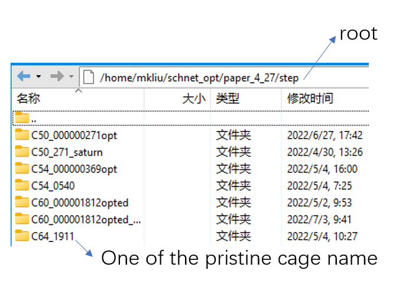

.. raw:: html

   

Fig 1. An AutoSteper workbase.

.. raw:: html

   

The ``gen_para`` and ``opt`` parameters configure a generator and an
optimizer. To simulate a stepwise addition reaction, one needs to
provide the ``run_para`` with the following parameters considered.

-  ``start``: the addition stage (:math:`\rm C_{2n}X_{start}`) when the
   simulation started. The first step will enumerate and evaluate all
   the non-isomorphic isomers without any filter.
-  ``stop``: the addition stage (:math:`\rm C_{2n}X_{stop}`) when the
   simulation started.
-  ``step``: number of the newly attached functional groups after the
   first step.
-  ``wht_list_para``: parameters to control the isomers saved in every
   step. These isomers will serve as seeds in the next step to generate
   derivatives. Details see next section.

AutoSteper would create sub-workbases for every addon number. Fig 2
presents one of the scenarios. In this case, the ``start`` value is 1,
the ``stop`` value is 10, and the ``step`` value is 1.

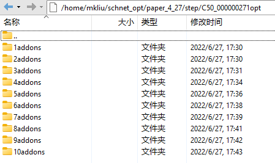

.. raw:: html

   

Fig 2. An AutoSteper sub-workbase.

.. raw:: html

   

The directory of the **first** step is illustrated in Fig 3.

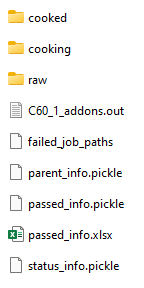

.. raw:: html

   

Fig 3. The first step workbase.

.. raw:: html

   

The functions of each file/directory are presented below.

-  ``raw``: the quasi-equilibrium isomers built in every step.
-  ``cooked``: the equilibrium state of each isomer, in ``xyz`` format.
-  ``cooking``: the real workbases for each optimization job. It
   typically contains more optimization details than the ``cooked``
   folder.
-  ``failed_job_paths``: the absolute path of each failed optimization
   job as well as their corresponding failed status code.
-  ``geom_1_addons.out``: the enumerated addition patterns in the first
   step. ``geom`` is the name of the pristine cage, ``1`` is the addon
   number of the first step.
-  ``passed_info.pickle``: key information of the optimization jobs that
   **passed** the topological check. In the early version of AutoSteper,
   this file is called ``deep_yes_info.pickle``, meaning information is
   stored in a deep chart. Fig 4 presents one of the scenarios. The
   meaning of each column is presented below:

   -  ``name``: the name for each isomer, in 36 format.
   -  ``energy``: the equilibrium energy of each isomer, in units eV.
   -  ``xyz_path``: the absolute path to each isomer structure, in
      ``xyz`` format.
   -  ``nimages``: the number of images in each optimization trajectory.

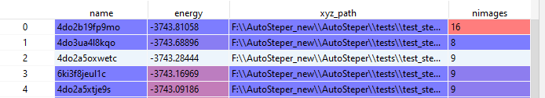

.. raw:: html

   

Fig 4. Example of the passed_info.

.. raw:: html

   

-  ``passed_info.xlsx``: excel format of ``passed_info.pickle``, up to
   1000 items stored.
-  ``parent_info.pickle``: key information of the **parent-son**
   relationships generated during the growth simulation. In the early
   version of AutoSteper, this file is called ``flat_yes_info.pickle``,
   meaning information is stored in a flat chart, and only the passed
   isomers are considered. The flat format enables a fast index when
   parsing the topological information.

   -  The first step is different from others since there is only one
      parent for all the :math:`\rm C_{2n}X_{start}` isomers. Fig 5
      presents one of the cases. The columns correspond to each
      :math:`\rm C_{2n}X_{start}` isomer. The first row corresponds to
      their energy.
   -  Fig 6 presents a case in the proceeding addition stages. The
      columns correspond to each :math:`\rm C_{2n}X_{m}, m>start`
      isomer. The first row stores the names of their parent(s). Note
      that, isomers in :math:`\rm C_{2n}X_{m}` addition stage could have
      more than one parent :math:`\rm C_{2n}X_{m-step}`. The second row
      corresponds to their energy.

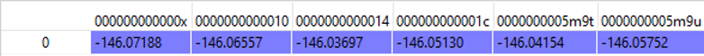

.. raw:: html

   

Fig 5. Example of the parent_info in the first step.

.. raw:: html

   

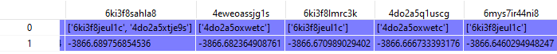

.. raw:: html

   

Fig 6. Example of the parent_info in the proceeding addition stages.

.. raw:: html

   

-  ``status_info.pickle``: the status code for each optimization job, in
   flat chart format for indexing convenience. Three types of status
   codes are reported:

   -  ``0``: normal termination.
   -  ``-2``: wrong jobs. This would happen when there are no files
      retrieved from computational resources, for example, the internet
      is broken, or the initial structure is so unphysical that the
      optimizer program went broken.
   -  ``>0``: the optimized isomer did not pass the topological check,
      their corresponding failed status codes will be reported. See the
      ``Checker`` section.

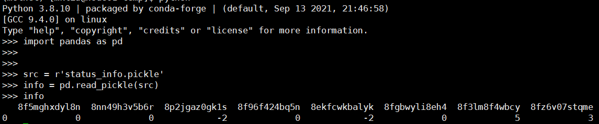

.. raw:: html

   

Fig 7. Example of the status_info.

.. raw:: html

   

An example about the co-occurrences of ``failed`` and ``wrong`` could be
found in
`test_random <https://github.com/Franklalalala/AutoSteper/blob/5763497ea281374ad517abff9a2e1903988b0664/gym/simulation/simulation_modes/test_random/test_random.py#L6>`__.
This module helps to maintain stable operation of the entire program.

The directory of the **proceeding addition stages** is illustrated in
Fig 8. The difference compared with the first step is presented below:

-  ``sub_nauty``: there is more than one parent that generates
   derivatives. Related information is dumped in this folder.

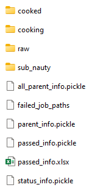

.. raw:: html

   

Fig 8. The workbase for the proceeding addition stages.

.. raw:: html

   

-  ``all_parent_info.pickle``: the parent-son information for all the
   :math:`\rm C_{2n}X_{m}` isomers. (see Fig 9.) This is generated when
   building the quasi-equilibrium isomers. Note that the
   ``parent_info.pickle`` only considers the passed ones, and it
   contains energy info. The ``all_parent_info.pickle`` stores
   duplicated but more detailed information, therefore it may be useful
   for future development.

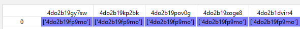

.. raw:: html

   

Fig 9. Example of the all_parent_info.

.. raw:: html

   

Cut-off
^^^^^^^

Generally speaking, there are two types of cutoff. The hard one,
``rank``, and the soft one, ``value``.

The reason to call ``rank`` as hard is that, for each step, there are
tens of thousands of isomers to be screened. We cannot estimate the
sparsity of low-energy isomers beforehand. We can only set an upper
limit base on our computational resources. That is, by default, 200. If
one has 5 times computational resources, this figure could be toggled to
1000. It’s **adjustable**.

On the other hand, from a chemical view, one needs to set this cutoff
with a soft criterion, ``value``. This figure is by default 1eV, and
it’s **adjustable**.

AutoSteper provides 4 modes to control the cutoff process:

-  ``rank``
-  ``value``
-  ``rank_or_value`` or ``value_and_rank``: both of the cutoffs need to
   be met.
-  ``rank_and_value`` or ``value_and_rank``: met anyone of the two
   cutoffs is sufficient.

By default, AutoSteper utilizes the ``rank_and_value`` mode, for
``rank``\ =200, ``value``\ =1eV. **This is adjustable.** **One may apply
any of the modes with any favored number.** See
`code <https://github.com/Franklalalala/AutoSteper/blob/773de279226b089141e580901894531e9dba70bd/src/autosteper/autosteper.py#L30>`__
and
`test <https://github.com/Franklalalala/AutoSteper/tree/master/gym/simulation/cutoff>`__.

A simple application of this function is to extract low-energy isomers
from an information pickle file, see
`get_low_e_xyz.py <https://github.com/Franklalalala/AutoSteper/blob/master/gym/simulation/cutoff/get_low_e_xyz.py>`__.

random
~~~~~~

The random mode could be used to sample targeted configuration space,
for example, building a dataset to train Neural Network Potential (NNP).
The parameters for random mode are basically the same as the step mode.
Differences lie in the ``run_para``, which is replaced by
``random_para``. Specifically, one needs to provide:

-  ``addon_list``: a list that consists of desired addon numbers, e.g,
   :math:`\rm C_{2n}X_{m}, m\ in\ addon\_list`.
-  ``random_num``: for each addon number m, the number of randomly
   sampled isomers :math:`\rm C_{2n}X_{m}`.
-  ``try_times``: since some systems are highly unstable, e.g,
   :math:`\rm C_{2n}X_{m}, m=2n`, all the isomers sampled could be
   unphysical and fail the topological check. In this case, the whole
   batch of isomers :math:`\rm C_{2n}X_{m}` should be discarded. This
   parameter is highly recommended to control the failed chances. Note
   that, it needs ``deal_wrong_mode`` set as ``Tough`` to properly
   function.

Despite these parameters, the execution method of AutoSteper changed
from ``run`` to ``random``. For an example script, see
`test_random <https://github.com/Franklalalala/AutoSteper/tree/master/gym/simulation/simulation_modes/test_random>`__.

base
~~~~

The base mode could be used to enumerate and evaluate all isomers for a
specific system :math:`\rm C_{2n}X_{m}`. In fact, it could be viewed as
the first step in the step mode. Since the base mode has only one step,
its input script doesn’t need ``run_para``. The rest of the parameters
stay the same as above. The execution method of AutoSteper changed from
``run`` to ``base``. For an example script, see
`test_base <https://github.com/Franklalalala/AutoSteper/tree/master/gym/simulation/simulation_modes/test_base>`__.

Generator
---------

The generator module is in charge of building molecules. Details of
parameters are presented below:

-  ``group``: the name of functional groups. Currently, AutoSteper
   supports :math:`\rm C_{2n}X_m(X=H, F,Cl, Br, I, OH, CF_3, CH_3)`.

-  ``gen_core_path``: the absolute path to the executable binary file
   ``cagesearch``, which is compiled from the
   `Franklalalala/usenauty <https://github.com/Franklalalala/usenauty>`__
   repository.

-  ``geom_mode``: decides how to build quasi-equilibrium isomers. This
   parameter is highly recommended to be set as ``pre_defined``. The
   pre-defined geometry parameters are chosen from thousands of randomly
   sampled isomers. If one needs to change these parameters, set
   ``geom_mode`` to another value and assign new parameters through
   ``geom_para``. Note that, the new format needs to stay consistent
   with `the
   original <https://github.com/Franklalalala/AutoSteper/blob/18f474b0dd58adc9cd7484007a14927e2cde5123/src/autosteper/generator.py#L12>`__.

Note that, the generator module could be used alone to build hand-tuned
structures. See
`build_unit <https://github.com/Franklalalala/AutoSteper/tree/master/gym/simulation/build_unit>`__.

Optimizer
---------

The optimizer module heavily rely on open-source package
`deepmodeling/dpdispatcher <https://github.com/deepmodeling/dpdispatcher>`__.
See `Getting
Started <https://docs.deepmodeling.com/projects/dpdispatcher/en/latest/getting-started.html>`__
to get familiar with dpdispatcher. Here presents the usage of
AutoSteper’s customized version.

machine and resource
~~~~~~~~~~~~~~~~~~~~

To start with, one needs to set a machine and a resource configuration.
Here present some examples.

For the machine parameter, two sets of configurations are recommended.
See below:

.. code:: python

   # from local (typically your win system) to clusters. Input scripts are submitted in Personal Computer (PC).
   mach_para = {
       'batch_type': "Torque",  # my cluster type
       'context_type': "SSHContext",
       'remote_root': '/home/test/xx/',  # the remote workbase where the actual computation take place.
       'remote_profile': {
           "hostname": "2xx.2xx.xx.7x",  # IP
           "username": "xx",
           "password": "xx",
           "port": 22,
           "timeout": 10
       }
   }

   # inside your clusters. Input scripts are submitted in the cluster.
   mach_para = {
       'batch_type': "Torque",  # my cluster type
       'context_type': "LocalContext",  # Do not need IP information
       'remote_root': '/home/test/xx/',
       'remote_profile': None
   }

For the resource parameter, here is an example:

.. code:: python

   resrc_para = {
       'number_node': 6, # the sequence name for your cluster.
       'cpu_per_node': 6, # computational resources for each task.
       'gpu_per_node': 0, # same as above
       'group_size': 10, # number of tasks contained in each job (group).
       'queue_name': "batch", # queue name for my cluster
       'envs': {              # extra enviromental variables
           "OMP_STACKSIZE": "4G",
           "OMP_NUM_THREADS": "3,1",
           "OMP_MAX_ACTIVE_LEVELS": "1",
           "MKL_NUM_THREADS": "3"
       },
       'sub_batch_size': 50 # number of tasks contained in each batch.
   }

The machine parameters tell the dpdispatcher **which cluster** to use
and **how to contact**, while the resource parameter **assigns**
computation resources to each job.

The original workflow of the dpdispatcher is illustrated in Fig 10.

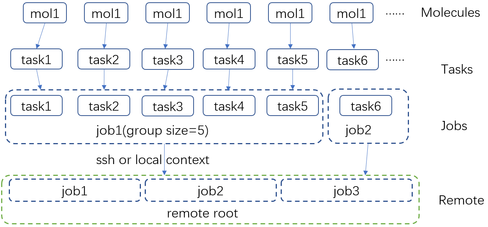

.. raw:: html

   

Fig 10. Simplified workflow of dpdispatcher.

.. raw:: html

   

Each optimization job corresponds to a task. Then, tasks are grouped
(``group_size``) into jobs. These jobs are submitted through ssh or
local context (``context_type``) to remote (``remote_root``), where the
remote would assign computational resources to each job
(``All_cpu_cores /cpu_per_node``) and execute them in parallel.

However, when it comes to huge task sequences, the number of groups in
line may put pressure on the cluster. And when something wrong happened
in a single job, the whole batch would be undermined. (For example, no
retrieval from remote.) Therefore, we proposed the ``sub_batch_size``
parameter to perform job dispatch in a mini-batch style. An illustration
of the modified dpdispatcher is presented in Fig 11.

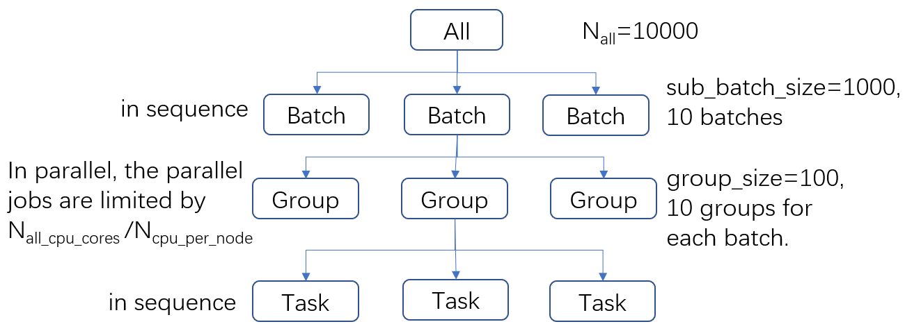

.. raw:: html

   

Fig 11. A top-down illustration of the modified dpdispatcher.

.. raw:: html

   

More details could be found in the documentation of `Machine
parameters <https://docs.deepmodeling.com/projects/dpdispatcher/en/latest/machine.html>`__
and `Resources
parameters <https://docs.deepmodeling.com/projects/dpdispatcher/en/latest/resources.html>`__.

opt mode and parameter
~~~~~~~~~~~~~~~~~~~~~~

Currently, AutoSteper provides interfaces for 3 software, namely, the
`xTB <https://xtb-docs.readthedocs.io/en/latest/contents.html>`__
program, the `Gaussian <https://gaussian.com/>`__ software, and the
`ASE <https://wiki.fysik.dtu.dk/ase/about.html>`__ python library. In
addition, AutoSteper provides the ``Multi_Optimizer`` to properly
integrate different software or employ the same software repeatly.
Examples could be found in
`optimizers <https://github.com/Franklalalala/AutoSteper/tree/master/gym/simulation/optimizers>`__.

The details about related parameters are presented below:

1. ``opt_mode``: tells the ``AutoSteper`` class or the
   ``switch_optimizers`` function which optimizer to choose.
2. ``cmd_list``: the actual command line in the final workbase (without
   the filename). It consists of the call of the program, options,
   flags, and so on.
3. ``out_list``: the names of output files that need to be downloaded.
4. ``deal_wrong_mode``: how to deal with wrong jobs, details see the
   engineering section.
5. ``has_parity``: The spin multiplicity is different between odd and
   even addon number isomers. Set this button true if you intend to
   simulate odd addon number isomers. This will enabling an automated
   multipicity check.

Checker
-------

The checker module will check optimized isomers to ensure an undermined
topology. 7 scenarios could be detected, their corresponding failed
status codes are presented below.

-  1: At least one functional group breaks the bond with the cage and
   becomes a radical.
-  2: At least one functional group deviates from the initial addition
   site and moves to another.
-  3: At least one 3-membered carbon ring is formed during optimization,
   meaning the pristine cage is squeezed by functional groups.
-  4: At least one carbon atom only has 2 neighboring carbon atoms or
   less, meaning the cage is broken.
-  5: At least one functional group binds with 2 or more carbon atoms,
   which is unstable for currently supported functional groups.
-  6: At least one carbon atom binds with 5 or more atoms, which means a
   small cluster or a coordination is formed.
-  7: The inner intactness of at least one functional group
   (:math:`\rm OH, CF_3, CH_3`) is undermined.

These status codes will be reported in the ``failed_job_paths`` file and
could be indexed from the ``status_info.pickle``. Additionally, these
status codes could be collected with help of ``clc_failed`` function,
see ``Analysis Functions`` section.

Need to mention that, the AutoSteper module doesn’t need any specific
input parameters for the checker module, though it could also be used
alone. See
`checker <https://github.com/Franklalalala/AutoSteper/tree/master/gym/simulation/checker>`__.

Path parser
-----------

The ``Path_Parser`` is an abstraction designed to get pathways from the
``parent-son`` information, which is generated along with the **Growth
Simulation**. This feature is considered since the very beginning of
AutoSteper. The ``parent-son`` information could be viewed as a
by-product of the simulation, therefore the calculation of pathways is
extremely fast.

One needs to provide the following parameters for a basic configuration:

.. code:: python

   path_para = {
       'step': 1, # the step that used in the growth simulation.
       'start': 1, # when the growth simulation started
       'q_add_num': 4, 
       'q_path_rank': 10,
       'q_isomer_rank': 5,
       'log_low_e_num': 10, 
   }

The configuration will generate pathways for :math:`\rm C_{2n}X_{m}\_i`.
Here the ``q_add_num`` is the m, the ``q_isomer_rank`` is i.
``log_low_e_num`` will dump low-energy isomers
:math:`\rm C_{2n}X_{m}\_i, i<log\_low\_e\_num` into a log.
``q_path_rank`` will decide how many low-energy pathways to be dumped.

This configuration parses pathways for the specific ``q_isomer_rank``.
All the pathways end to the
:math:`\rm C_{2n}X_{m}\_i, i=q\_isomer\_rank`.

To see a mixed scenario, simply set the ``is_mixed`` flag to True. The
generated pathways will end to
:math:`\rm C_{2n}X_{m}\_i, i<=q\_isomer\_rank`.

If one needs a higher accuracy of pathways, there is a refiner option in
``Path_Parser``. If one needs to control the number of pathways, set a
``ctl_path_para`` as below:

.. code:: python

   path_para = {
       'step': 1, # the step that used in the growth simulation.
       'start': 1, # when the growth simulation started
       'q_add_num': 22, 
       'q_path_rank': 10,
       'q_isomer_rank': 5,
       'log_low_e_num': 10, 
       'ctl_path_para': {
           'ctl_parent_num': 3, # Control the number of parents for each isomer.
           'max_path_num': 10000, # Control the maximum number of pathways.
       }
   }

This is for the case when the queried addon number is very high. Since
the ``Path_Parser`` functions in a DFS way, the low-energy pathways will
be well preserved.

The generated pathways are highly structured and informative, see
`path_parser <https://github.com/Franklalalala/AutoSteper/tree/master/gym/simulation/path_parser>`__.
Here presents the well-designed heatmap. See Fig 12. This is the pathway
for :math:`\rm C_{60}Cl_6` under xTB level of theory.

.. image:: ./fig/Path_relative_energy.png
   :alt: Path_relative_energy
   :align: center

.. raw:: html

   

Fig 12. Example of the generated heatmap for pathways.

.. raw:: html

   

It well-explained the ranking of pathways. For example, all the related
isomers for the pathway in row 1 is the lowest-energy one (relative
energy is 0), therefore it’s the lowest-energy pathway.

Black list
----------

The concept of the blacklist is based on the assumption that high-energy
isomers probably contain local instability motifs, therefore their
derivatives will unlikely to become stable ones since they still contain
those instability motifs. This is a dual concept to the low-energy
configuration space, which is treated as seeds to generate derivatives.
See Fig 13.

AutoSteper collects two kinds of isomers into the blacklist.

1. The isomers that failed the topological check. (denote as failed)
2. The high-energy isomers within certain reverse cutoff. (denote as
   unstable)

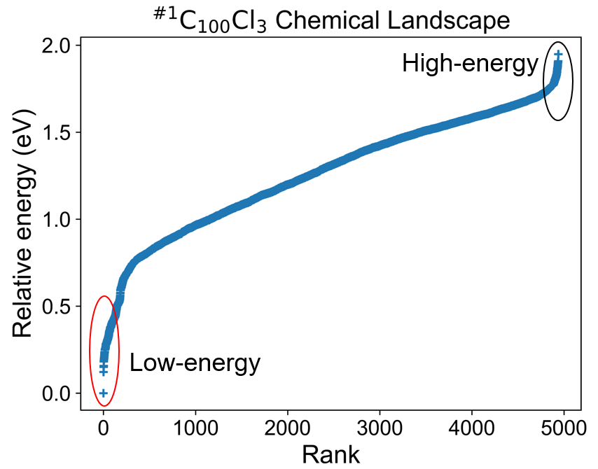

.. raw:: html

   

Fig 13. Illustration of the high-energy configuration space.

.. raw:: html

   

When it comes to a new step, the new addition patterns will check
through the blacklist at first. If a pattern contains any of the
recorded patterns, it will be directly skipped.

To control the influence of a high-energy pattern, AutoSteper provides a
queue to store high-energy patterns. See Fig 14.

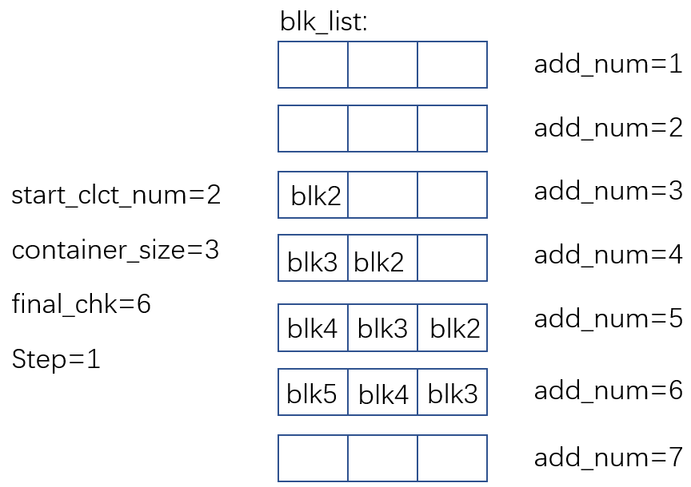

.. raw:: html

   

Fig 14. Illustration of the queue maintained by AutoSteper.

.. raw:: html

   

AutoSteper starts collecting high-energy isomers in ``start_clct_num``.
These patterns start functioning in the next step and will continue to
function till ``start_clct_num+container_size*step``. The blacklist
system will shut down after ``final_chk``.

To enable the blacklist feature, one needs to provide a ``blk_para``.
Here is an example of ``blk_para``, for example of an input script, see
`black_list <https://github.com/Franklalalala/AutoSteper/tree/master/gym/simulation/black_list>`__.

.. code:: python

   blk_para = {
       'start_clct_num': 2,
       'final_chk_num': 8,
       'clct_unstb': True,
       'unstb_para': {
           'mode': 'rank',
           'rank': 10,
       },
       'container_size': 3
   }

Note that, all failed addition patterns are collected by default as long
as the blacklist system functions. Another kind of high-energy isomers
is collected when the ``clct_unstb`` is Ture. The ``unstb_para``
controls the reversed cutoff range, details see
`test_cutoff <https://github.com/Franklalalala/AutoSteper/tree/master/gym/simulation/cutoff>`__.

Pre-scan
--------

The pre-scan feature takes the quasi-equilibrium geometry to approximate
the equilibrium state isomer. Since AutoSteper builds quasi-equilibrium
isomers in a python environment, currently only the python package
`ASE <https://wiki.fysik.dtu.dk/ase/about.html>`__ is supported as the
single-point evaluator.

The generated isomer (in ``atom`` class) would go through a single-point
evaluation before dumping to a xyz format file. After the generation of
all isomers, the low-energy ones will be selected and re-dumped into the
``post_pre_scan_raw`` folder. These isomers would undergo geometry
optimization with optimizers. Fig 15 presents a working folder when the
pre-scan feature is enabled. It’s basically the same as the ``step``
mode workbase.

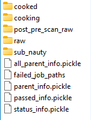

.. raw:: html

   

Fig 15. The workbase when the pre-scan feature enabled.

.. raw:: html

   

To enable a pre-scan feature, one needs to provide a ``pre_scan_para``.
Here is an example of ``pre_scan_para``, for example of an input script,
see
`test_pre_scan <https://github.com/Franklalalala/AutoSteper/blob/master/gym/simulation/pre_scan_restart/test_pre_scan.py>`__.

.. code:: python

   pre_scan_para = {
       'start_ps_para': 2,  # when the pre-scan feature enabled
       'final_ps_para': 3,  # when the last addition stage that the pre-scan feature functions
       'calculator': calculator, # the calculator in ASE format
       'ps_cut_para': {     # to control the cutoff range
           'mode': 'rank',
           'rank': 80
       }
   }

Note:

1. The ``calculator`` needs to stay in
   `ASE <https://wiki.fysik.dtu.dk/ase/ase/calculators/calculators.html#calculators>`__
   format.
2. The ``ps_cut_para`` controls the cutoff range for the isomers that
   need geometry optimization.

Engineering
-----------

Currently, AutoSteper provides ``restart`` and ``error_handling`` for
engineering convenience. More features are under development.

restart&proceed
~~~~~~~~~~~~~~~

The ``restart`` feature is designed for the step mode in case the
simulation is interrupted. To use it, simply replace the execution
method of AutoSteper to ``restart``. For example:

.. code:: python

   # auto.run()
   auto.restart(restart_add_num=5)

Note that, the ``restart`` method will delete the original workbase for
:math:`\rm C_{2n}X_{m}, m>= restart\_add\_num`, after that, a new
workbase will be created for
:math:`\rm C_{2n}X_{m}, m= restart\_add\_num`. Make sure the
``restart_add_num`` equals the exact to addon stage when the simulation
was interrupted.

Besides, this feature could be used to **proceed** with a normally
terminated simulation. For example, the original one terminated in
``add_num = 4``, and the restart_add_num could be set as ``4+step``. See
`test_restart <https://github.com/Franklalalala/AutoSteper/blob/master/gym/simulation/pre_scan_restart/test_restart.py>`__.

error handling
~~~~~~~~~~~~~~

The ``error_handling`` feature is assigned to optimizers. For
description convenience, details of them are presented in this section.
Note that, the ``error`` mentioned here denotes an unexpected
optimization task result, which is different from the ``failed``
notation.

There are 4 modes in total. Specifically:

-  ``Report``: simply report the wrong information and end out.
-  ``Complete``: recursively submit jobs in small batches to minimize
   the wrong jobs, then end out. Note that, the dpdispatcher submits
   jobs in a batch style. When there is one job ends unexpectedly, there
   would be no retrieval from the remote for the whole batch. The
   ``Complete`` mode will submit recursively with small batches until
   the abnormal ones are left.
-  ``Tough``: designed for ``random`` mode in case the whole batch of
   randomly generated isomers are unphysical. The old batch will be
   discarded and a new batch will be generated.
-  ``Ignore``: designed for ``random`` mode in case there are abnormally
   terminated jobs. There will be warnings while the simulation
   proceeds.

Examples about how this feature function is presented in
`test_random <https://github.com/Franklalalala/AutoSteper/blob/5763497ea281374ad517abff9a2e1903988b0664/gym/simulation/simulation_modes/test_random/test_random.py#L6>`__.
